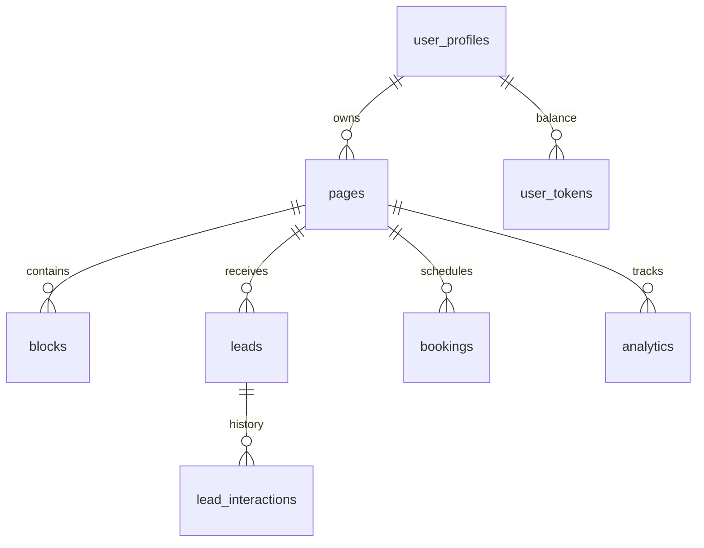

# lnkmx — Ультимативный гид по платформе (Encyclopedia v2026.02)

Платформа lnkmx — это не просто конструктор персональных страниц. Это полноценная **Business Operating System (Solo OS)**, спроектированная для экономики независимых специалистов (Solo-Economy). Мы объединили создание сайтов, управление клиентами, аналитику и финансовые инструменты в единую мобильную экосистему.

---

## 1. Продуктовое видение и стратегия

### 1.1 Миссия и цель

**Миссия**: Стереть границы между маркетингом и операционным управлением для микро-бизнеса. Мы устраняем «налог на инструменты» (необходимость платить за 5+ сервисов), предоставляя унифицированную инфраструктуру «всё-в-одном» за 15 минут.
**Виджение**: Стать дефолтной «Identity + Business OS» для каждого специалиста в Центральной Азии и на развивающихся рынках.

### 1.2 Целевые аудитории и решения

| Персона | Проблема/Боли | Решение от lnkmx |
| :--- | :--- | :--- |
| **Beauty-мастер** | Хаос в записях через DM, отсутствие предоплат, клиентская база в блокноте. | Нативный **Booking Block** с календарем + **Portfolio Carousel** + **Services List** + CRM для учета клиентов. |
| **Коуч/Эксперт** | Продажа вебинаров через ручные переводы, разрозненные ссылки на гайды. | **Event Block** (регистрация и билеты) + **Lead Form** + **Digital Product Download** с оплатой. |
| **Риэлтор** | Обезличенные страницы агентств, сложные CRM, потеря персонального бренда. | **Lead Capture** (мгновенные уведомления в TG) + **Property Catalog** + Персональный бренд на базе Liquid Glass. |

### 1.3 Стратегические столпы

1. **Сложность как грех**: Мы ориентируемся на пользователей, которые являются экспертами в своем деле, а не в ИТ. Пользовательский путь спроектирован так, чтобы страница создавалась без чтения документации.
2. **Дизайн-система "Liquid Glass"**: Мы инвестируем в «дизайнерский капитал» пользователя. Высокий уровень визуала автоматически повышает доверие к специалисту.
3. **Нативная экосистема**: Мы не интегрируемся с Calendly — мы заменяем его. Это позволяет нам владеть данными по всей воронке (от клика до оплаты).

---

## 2. Основные модули и Технические спецификации

### 2.1 AI Page Builder

Ядро системы, использующее динамический диспетчер блоков `BlockRenderer.tsx`.

- **AI-Onboarding**: Использует Google Gemini для анализа ниши. Промпты жестко ограничены для исключения галлюцинаций.
- **Auto-save**: Zustand-state синхронизируется с БД с дебаунсом 1.5 сек. Используется Request Versioning для предотвращения перезаписи старыми данными.
- **Multilingual**: Поддержка `ru, en, kk, uz` на уровне БД. Все строковые поля блоков используют тип `MultilingualString`.

### 2.2 Mini-CRM и Управление лидами

- **Pipeline**: Система статусов `new -> contacted -> qualified -> won/lost`.
- **Inbox**: Единый интерфейс для `leads`, `bookings` и `event_registrations`.
- **Notifications**: Edge-функция `send-lead-notification` отправляет PUSH в Telegram-бот через 500мс после создания лида.

### 2.3 Business Zones (Мультиарендность)

- **Workspaces**: Изоляция через `zone_id`.
- **RBAC**: Роли проверяются через DB-функцию `public.has_role(auth.uid(), 'admin')`.
- **Kanban**: Drag-and-drop интерфейс для управления сделками в реальном времени.

### 2.4 Advanced Analytics (Pixel Proxy)

- **CAPI Integration**: Серверная отправка событий в Facebook CAPI и TikTok Events API для обхода блокировщиков (Ad-blockers).
- **Insights**: Расчет CTR каждого блока в реальном времени.

### 2.5 Fintech Ledger

- **Ledger**: Каждая операция записывается как минимум в две таблицы (`wallet_transactions` и `ledger_logs`) для обеспечения целостности.
- **GMV Tracking**: Мониторинг оборота через инвойсы.

---

## 3. Архитектура и Инфраструктура

### 3.1 Технологический стек

- **Frontend**: React 18, Vite (SPA), TypeScript.
- **State**: Zustand (Editor), React Query (Server cache).
- **Backend**: Supabase (Postgres, Auth, Storage).
- **Edge**: Deno Runtime (Edge Functions).

### 3.2 Схема данных (Core Entities)



### 3.3 Список критических Edge Functions (28+)

| Функция | Задача | Триггер |
| :--- | :--- | :--- |
| `ai-content-generator` | Генерация контента страницы | UI Dashboard |
| `seo-ssr` | Предрендеринг для ботов (SSR) | Запрос от робота |
| `pixel-proxy` | Серверная отправка аналитики | События на странице |
| `create-lead` | Валидация и сохранение лида | Форма на странице |
| `robokassa-webhook` | Обработка платежей | Уведомление от банка |
| `telegram-bot-webhook` | Обработка команд в боте | Сообщение в ТГ |

---

## 4. Дизайн-система "Liquid Glass"

Дизайн lnkmx — это наш главный Moat (ров).

- **Glassmorphism**: Использование `backdrop-blur-xl`, полупрозрачных фонов (`bg-white/10`) и тонких границ (`border-white/20`).
- **Design Tokens**:
  - `shadow-glass`: Глубокие, мягкие тени с размытием.
  - `text-gradient`: Градиенты на заголовках для премиального вида.
- **Animations**:
  - Нативные CSS-переменные для плавности.
  - Framer Motion для сложных переходов между экранами дашборда.

---

## 5. Реестр и аудит блоков

| Тип блока | Категория | Статус | Премиум? |
| :--- | :--- | :--- | :--- |
| **Profile** | Basic | ✅ OK | Нет |
| **Link** | Basic | ✅ OK | Нет |
| **Booking** | Commerce | ✅ OK | Да |
| **Event** | Social | ✅ OK | Да |
| **Scratch** | Interactive | ✅ OK | Да |
| **Custom Code** | Interactive | ✅ OK | Да |
| **Carousel** | Media | ✅ OK | Да |

**Стандарт качества**: Все блоки должны проходить `TypeCheck`, иметь `Unit Tests` и поддерживать `MultilingualString`.

---

## 6. Продуктовый роадмап 2026

### Q2 2026: Mobile Dominance

- Запуск нативных приложений (iOS/Android) на базе Capacitor.
- Push-уведомления о лидах и записях.
- **Booking V2**: Двусторонняя синхронизация с Google Calendar.

### Q3 2026: Open Platform

- **Public API**: Для интеграции с Zapier, Make и AmoCRM.
- **White-Label Mode**: Полное удаление брендинга lnkmx для агентств.

### Q4 2026: Fintech & Monetization

- **Link Wallet**: Прием платежей напрямую на карту владельца.
- **Paywalls**: Платный доступ к контенту или скачиванию файлов.

---

## 7. Безопасность и Операции

### 7.1 RLS Паттерны

```sql
-- Пример политики для защиты лидов
CREATE POLICY "Users can only view own leads" 
ON public.leads FOR SELECT 
USING (auth.uid() = user_id);
```

Безопасность инкапсулирована на уровне БД. Приложение никогда не запрашивает данные без фильтрации по `auth.uid()`.

### 7.2 Инцидент-респонс (Runbook)

- **SLA**: Доступность платформы 99.9%.
- **SEV-1**: Немедленное переключение на резервные Edge-ноды, уведомление в Telegram-канал мониторинга.
- **Content Moderation**: Скрипты на базе Google Vision API автоматически блокируют страницы с NSFW-контентом или фишингом.

---

## 8. Методологии и Аналитика (Strategic Layer)

### 8.1 Customer Journey Map (CJM)

*Пример в lnkmx*: Мы отслеживаем путь от клика по ссылке в Instagram до публикации страницы и получения первого лида. Узкое место — AI-генерируемый контент (если он слишком общий, юзер уходит).

### 8.2 Customer Development (CustDev)

*Пример*: Регулярные интервью с мастерами маникюра привели к созданию блока "Скретч-карта" для удержания клиентов.

### 8.3 Jobs To Be Done (JTBD)

*Работа*: «Когда у меня запускается предзапись на курс, я хочу быстро собрать страницу с формой, чтобы не тратить время на верстку и начать продажи».

### 8.4 User Story Mapping (USM)

Метод планирования релизов: от "Показать кнопки" до "Автоматизировать рассылку по лидам".

### 8.5 Unit Economics

Мы считаем CAC (стоимость привлечения) через виральный коэффициент (K-factor) от вотермарка.

### 8.6 Pirate Metrics (AARRR)

- **Acquisition**: Органический рост через страницы пользователей.
- **Activation**: Публикация страницы в первые 5 минут.
- **Retention**: Частота входа в CRM.
- **Referral**: Linkkon токены.
- **Revenue**: Подписка Pro за 2900 ₸.

### 8.7 North Star Metric

**Active Leads Processed**: Количество лидов, которые наши пользователи успешно обработали через нашу CRM.

### 8.8 SWOT-анализ

- **S**: Дизайн Liquid Glass.
- **W**: Зависимость от Supabase.
- **O**: Рост экономики создателей.
- **T**: Агрессия Linktree на рынке СНГ.

### 8.9 HADI-циклы

Еженедельная проверка гипотез. Пример: «Если заменить кнопку "Создать" на "Запустить бизнес", конверсия вырастет на 3%».

### 8.10 RICE Scoring

Метод приоритизации бэклога: Reach (охват), Impact (влияние), Confidence (уверенность), Effort (затраты).

### 8.11 Lean Canvas

Бизнес-модель на одной ладони: от проблемы "Tool Tax" до решения "Solo OS".

### 8.12 Cohort Analysis

Анализ жизни групп пользователей (когорт) для понимания того, как обновления влияют на Retention.

### 8.13 Marketing Mix (7P)

Product, Price, Place, Promotion, People, Process, Physical Evidence.

### 8.14 OKRs

Цель: Стать №1 в Центральной Азии. Ключевой результат: 100k активных мерчантов к концу 2026 года.

---

## 9. Быстрый старт разработчика

1. **Клонирование**: `git clone <url>`
2. **Зависимости**: `npm install`
3. **Окружение**: Настроить `.env` (URL и ANON KEY от Supabase).
4. **Запуск**: `npm run dev` (доступ по localhost:3000).
5. **Тесты**: `npm run test` (всегда запускать перед деплоем).

---

*Документ обновлен: 27 февраля 2026 г.*
*Maintained by: Antigravity Team*
