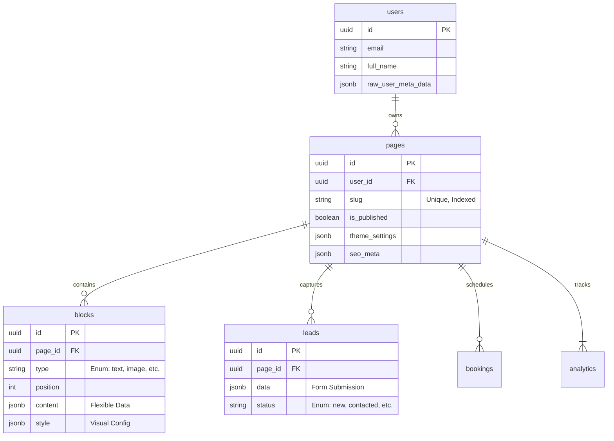

# Database Schema Guide

> **Objective:** Document the data model, including schemaless JSON fields.

## 1. Core Entities (ERD)



---

## 2. JSON Field Structures

Supabase allows flexible JSONB columns. We enforce structure via Zod schemas in the code, but the DB allows flexibility.

### 2.1 `pages.theme_settings`
Configures the global look of the page.
```json
{
  "font": "Inter",
  "background": {
    "type": "gradient",
    "value": "linear-gradient(to right, #ff0000, #0000ff)"
  },
  "buttons": {
    "radius": "full",
    "style": "outline"
  }
}
```

### 2.2 `blocks.content`
Varies by `block.type`.

**Type: `link`**
```json
{
  "url": "https://example.com",
  "label": "My Website",
  "icon": "globe"
}
```

**Type: `image`**
```json
{
  "url": "https://supabase.../image.jpg",
  "alt": "Profile Photo",
  "aspectRatio": "1/1"
}
```

**Type: `form`**
```json
{
  "fields": [
    { "id": "name", "type": "text", "label": "Your Name" },
    { "id": "email", "type": "email", "label": "Your Email" }
  ],
  "submitLabel": "Send Message"
}
```

---

## 3. Critical Tables Reference

| Table | RLS | Description |
|---|---|---|
| `users` | Owner | Extends Supabase `auth.users`. Stores profile info. |
| `pages` | Public/Owner | Main entity. Row per landing page. |
| `blocks` | Public/Owner | Content units. Ordered by `position`. |
| `leads` | Owner | Form submissions. Encrypted/Protected heavily. |
| `analytics` | Public (Append) | Event log (page_view, click). High write volume. |

## 4. Migrations & Changes

- Migrations are stored in `supabase/migrations/`.
- **Naming:** `YYYYMMDDHHMMSS_description.sql`.
- **Apply:** `supabase db push` (Local) / `supabase db reset` (Wipe & Re-apply).
- **Production:** Applied via CI/CD pipeline.
