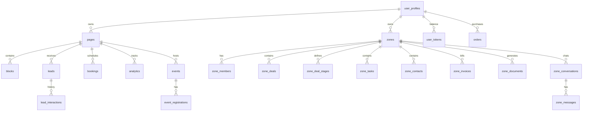

# LinkMAX — Полное описание платформы

> **Версия:** 3.1  
> **Дата:** 4 апреля 2026  
> **Статус:** Актуальный  
> **Язык документа:** Русский

---

## Содержание

1. [Что такое LinkMAX](#1-что-такое-linkmax)
2. [Миссия, видение, ценности](#2-миссия-видение-ценности)
3. [Целевые аудитории и персоны](#3-целевые-аудитории-и-персоны)
4. [Пользовательские роли и пути](#4-пользовательские-роли-и-пути)
5. [Основные модули платформы](#5-основные-модули-платформы)
6. [Каталог блоков (28+ типов)](#6-каталог-блоков)
7. [Бизнес-зоны (Multi-Tenant CRM)](#7-бизнес-зоны)
8. [Монетизация (Step-by-Growth)](#8-монетизация)
9. [Архитектура и стек](#9-архитектура-и-стек)
10. [Структура репозитория](#10-структура-репозитория)
11. [Схема данных](#11-схема-данных)
12. [Edge Functions (28+)](#12-edge-functions)
13. [SEO, AEO и индексация](#13-seo-aeo-и-индексация)
14. [Дизайн-система Liquid Glass](#14-дизайн-система-liquid-glass)
15. [Интернационализация (i18n)](#15-интернационализация)
16. [Безопасность и RLS](#16-безопасность-и-rls)
17. [Гамификация и социальные функции](#17-гамификация-и-социальные-функции)
18. [Интеграции и внешние сервисы](#18-интеграции-и-внешние-сервисы)
19. [Дорожная карта 2026-2027](#19-дорожная-карта)
20. [Юнит-экономика и метрики](#20-юнит-экономика-и-метрики)
21. [Конкурентное позиционирование](#21-конкурентное-позиционирование)
22. [Быстрый старт разработчика](#22-быстрый-старт-разработчика)

---

## 1. Что такое LinkMAX

**LinkMAX** (домен: `lnkmx.my`) — это **Business Operating System (Solo OS)** нового поколения. Платформа объединяет в себе:

- 🎨 **AI Page Builder** — конструктор страниц с 28+ типами блоков и дизайн-системой "Liquid Glass"
- 📊 **Mini-CRM** — управление лидами, бронированиями и регистрациями на события
- 🏢 **Бизнес-зоны** — полноценные рабочие пространства с Kanban-сделками, задачами, контактами, инвойсами и ЭДО
- 📈 **Advanced Analytics** — серверная аналитика (Pixel Proxy) для FB, TikTok, GA4
- 💰 **Fintech Core** — встроенные платежи, внутренний леджер, транзакционная монетизация

**Главная ценность:** Устранение «налога на инструменты» — вместо 5+ разрозненных SaaS-сервисов (Wix + Calendly + Mailchimp + CRM + Google Sheets), микро-бизнес получает единую инфраструктуру за 15 минут настройки.

**Позиционирование:** "Anti-Bitrix/AmoCRM" для соло-предпринимателей — простая, быстрая, mobile-first альтернатива корпоративным CRM.

---

## 2. Миссия, видение, ценности

### Миссия
Стереть границы между маркетингом и операционным управлением для микро-бизнеса. Дать каждому специалисту инструменты, которые раньше были доступны только Fortune 500.

### Видение
Стать дефолтной «Identity + Business OS» для каждого специалиста в Центральной Азии и на развивающихся рынках, где каждая "ссылка в био" — это полноценный бизнес-бэкенд.

### Ключевые ценности

| Ценность | Принцип |
| :--- | :--- |
| **Простота как религия** | Если действие требует больше 3 кликов — оно сломано. Целевой пользователь — эксперт в выпечке/преподавании/продажах, а не в ИТ. |
| **Премиум по умолчанию** | Дизайн-система "Liquid Glass" гарантирует, что даже бесплатный пользователь выглядит дорого. Эстетика — наш вирусный цикл. |
| **Нативная мощность** | Мы не "линкуем" на другие инструменты — мы их заменяем. Нативные формы, букинг, аналитика, CRM. |

---

## 3. Целевые аудитории и персоны

### 8 ключевых ниш

| # | Ниша | Боли | Решение LinkMAX |
| :--- | :--- | :--- | :--- |
| 1 | **Beauty-мастер** | Хаос в записях через DM, нет предоплат, клиентская база в блокноте | Booking Block + Portfolio Carousel + Services List + CRM Zone |
| 2 | **Коуч/Эксперт** | Продажа вебинаров через ручные переводы, разрозненные ссылки на гайды | Event Block (регистрация+билеты) + Lead Form + Digital Product |
| 3 | **Дизайнер/Фрилансер** | Нужно портфолио + прайс + способ получить заказ | Carousel + Pricing Block + Form + Бизнес-зона (Сделки) |
| 4 | **Стартап** | MVP-сайт + быстрый CRM без разработки | AI генерация страницы + Zone (Kanban + Tasks + Contacts) |
| 5 | **Агентство** | Управление несколькими клиентами, командная работа | Multi-page + White-label + Team Inbox + Zone Roles |
| 6 | **Клиника/Студия** | Бронирование приёмов, напоминания, карта | Booking + Map + CRM + Telegram уведомления |
| 7 | **Риэлтор** | Обезличенные страницы агентств, потеря бренда | Lead Capture + Property Catalog + Zone (Deals) |
| 8 | **Креатор/Инфлюенсер** | Линк-в-био без бизнес-функций | Profile + Links + Products + Events + Analytics |

### TAM / SAM / SOM (Рынок)

- **TAM**: 50M+ соло-предпринимателей в СНГ + развивающиеся рынки
- **SAM**: 5M специалистов, активно использующих link-in-bio инструменты в KZ/RU
- **SOM**: 100K пользователей к Q2 2027

---

## 4. Пользовательские роли и пути

### 4.1 Посетитель (Visitor)

**Что видит:**
- Профиль создателя (аватар, имя, био, бейдж верификации)
- Блоки контента: ссылки, продукты, услуги, галереи, события
- Интерактивные элементы: формы бронирования, регистрация на события

**Действия:**
- Клик по ссылкам/кнопкам → трекинг `block_click`
- Отправка формы → создание записи в `leads`
- Регистрация на событие → `event_registrations` + получение email/билета
- Бронирование → создание `bookings` с выбранным слотом
- Скачивание файлов, просмотр видео, обзор каталога

**Собираемые данные (анонимизированные):**
- Просмотры страниц (`analytics.event_type = 'page_view'`)
- Клики по блокам с привязкой к `block_id`
- UTM-параметры в `metadata` JSON
- Отправки форм с согласием пользователя

---

### 4.2 Создатель (Creator / Page Owner)

**Основной путь пользователя:**

```
Регистрация → AI Onboarding (3 шага) → Страница сгенерирована → Кастомизация блоков → Публикация → Поделиться ссылкой → Отслеживание аналитики → Управление лидами
```

**Детализация пути:**

1. **Регистрация** — Email/Password или OAuth (Google/Apple)
2. **AI Onboarding** — 3 шага: выбор ниши → описание бизнеса → AI генерирует страницу с блоками
3. **Редактирование** — Drag-and-drop редактор с inline-редактированием, auto-save (1.5сек debounce)
4. **Публикация** — Нажатие "Publish" → страница доступна по `lnkmx.my/{slug}`
5. **Шеринг** — QR-код, соц.сети, копирование ссылки
6. **Аналитика** — Просмотры, клики, конверсии, CTR по блокам
7. **CRM** — Входящие лиды, бронирования, регистрации → обработка и конверсия

**Секции Dashboard V2:**

| Экран | Компонент | Назначение |
| :--- | :--- | :--- |
| **Редактор** | `EditorScreen.tsx` | Управление блоками, drag-and-drop, inline-редактирование |
| **Аналитика** | `InsightsScreen.tsx` | Просмотры, клики, конверсии |
| **CRM** | `ActivityScreen.tsx` | Лиды, бронирования, регистрации |
| **Настройки страницы** | `PageSettingsScreen.tsx` | Slug, SEO, брендинг, пиксели |
| **Настройки разработчика** | `DeveloperSettings.tsx` | Управление API ключами (`lk_live_`) и вебхуками |
| **Настройки аккаунта** | `AccountSettingsScreen.tsx` | Профиль, биллинг, уведомления |

**Мульти-страничность:**
- Переключение между страницами через sidebar
- У каждой страницы уникальный slug: `lnkmx.my/{slug}`
- Pro-пользователи: до 6 страниц с возможностью апгрейда каждой

---

### 4.3 Администратор (Admin)

**Доступ:** `/admin` (требует `app_role = 'admin'`)

| Раздел | Назначение |
| :--- | :--- |
| **Users** | Все пользователи, премиум-статус, бан/разбан |
| **Pages** | Все страницы, модерация, добавление в галерею |
| **Analytics** | Метрики всей платформы |
| **Tokens** | Управление экономикой Linkkon-токенов |
| **Subscriptions** | Управление планами, продление триалов |
| **Events** | Все события и регистрации |
| **Verification** | Проверка заявок на верификацию |
| **Partners** | Управление партнёрскими логотипами |

---

### 4.4 Участник Бизнес-зоны (Zone Member)

**Путь:** Приглашение по email → Принятие → Выбор роли → Работа в зоне

**Роли:**
| Роль | Права |
| :--- | :--- |
| **Owner** | Полный доступ, биллинг, удаление зоны |
| **Admin** | Управление участниками, все модули |
| **Member** | Работа с сделками, контактами, задачами |
| **Viewer** | Только просмотр данных |

---

## 5. Основные модули платформы

### 5.1 AI Page Builder

Ядро платформы, использующее динамический рендеринг через `BlockRenderer.tsx`.

- **AI Onboarding**: Google Gemini анализирует нишу и генерирует страницу с оптимальным набором блоков
- **Auto-save**: Zustand → синхронизация с БД (debounce 1.5сек) + Request Versioning
- **Версионирование**: `page_snapshots` хранит последние 5 версий для отката
- **Мультиязычность**: Все строковые поля поддерживают `MultilingualString` (RU/EN/KK/UZ)

### 5.2 Mini-CRM (Personal Dashboard)

- **Leads**: Pipeline `new → contacted → qualified → won/lost`
- **Единый инбокс**: Лиды, бронирования и регистрации в одном потоке
- **Автоматизации**: Настраиваемые follow-up триггеры через `crm_automations`
- **Уведомления**: Telegram-бот для мгновенных push-уведомлений о новых лидах

### 5.3 Advanced Analytics (Pixel Proxy)

- **CAPI**: Серверная отправка событий в Facebook CAPI и TikTok Events API → обход Ad-blockers
- **Метрики**: CTR по блокам, источники трафика, география
- **A/B тесты**: Эксперименты по вариантам блоков с отслеживанием конверсий
- **Пиксели**: FB Pixel, TikTok Pixel, GA4, Яндекс.Метрика

### 5.4 Fintech Core

- **Step-by-Growth**: Транзакционная модель (0$ + 7% для Starter)
- **Ledger**: Операции в `wallet_transactions` и `ledger_logs`
- **Платежные шлюзы**: Robokassa, Kaspi QR
- **Инвойсы**: Автоматическая нумерация, мульти-позиционные счета

### 5.5 SEO/SSR Engine

- **Bot Detection**: Cloudflare Worker → Edge Function `seo-ssr`
- **Pre-render**: HTML для роботов с JSON-LD и Schema.org
- **Sitemap**: Динамическая генерация (10k+ URL)
- **AEO/GEO**: Answer Blocks для AI-краулеров (Perplexity, GPT, Gemini)

---

## 6. Каталог блоков

### Бесплатные блоки (11 типов)

| Блок | Что видит посетитель | Что настраивает создатель | Use case |
| :--- | :--- | :--- | :--- |
| **profile** | Аватар, имя, био, бейдж | Фото, имя, текст, стиль рамки, анимации | Главная секция, личный бренд |
| **link** | Кликабельная карточка-ссылка | URL, заголовок, иконка, стиль фона | Внешние ссылки |
| **button** | CTA-кнопка | URL, текст, hover-эффекты, ширина | Основные действия |
| **text** | Форматированный текст | Контент, стиль (заголовок/параграф/цитата) | Описания, заголовки |
| **separator** | Горизонтальный разделитель | Стиль, толщина | Визуальное разделение |
| **avatar** | Изображение профиля | Фото, имя, подзаголовок, рамка | Дополнительные профили |
| **socials** | Иконки соц.сетей | Список платформ с URL | Присутствие в соцсетях |
| **messenger** | Ярлыки мессенджеров | WhatsApp, Telegram, Viber | Прямой контакт |
| **image** | Изображение с подписью | Загрузка, alt-текст, ссылка | Визуальный контент |
| **map** | Карта Google Maps | Строка адреса | Показ локации |
| **faq** | Аккордеон вопрос-ответ | Пары вопрос/ответ | Частые вопросы |

### Премиум-блоки (17 типов)

| Блок | Назначение |
| :--- | :--- |
| **video** | YouTube/Vimeo embed |
| **carousel** | Слайдшоу изображений (портфолио) |
| **custom_code** | Встроенный HTML/CSS/JS виджет |
| **form** | Форма захвата лидов |
| **newsletter** | Подписка на рассылку |
| **testimonial** | Карусель отзывов |
| **scratch** | Скретч-карта (гамификация, промо) |
| **catalog** | Сетка/список товаров с ценами |
| **countdown** | Таймер обратного отсчёта |
| **before_after** | Сравнительный слайдер (до/после) |
| **download** | Кнопка скачивания файла |
| **product** | Карточка одного товара |
| **pricing** | Прайс-лист услуг |
| **shoutout** | Рекомендация другого пользователя |
| **community** | Ссылка на Telegram-группу |
| **booking** | Календарь бронирования |
| **event** | Событие с регистрацией и билетами |

**Код блоков:**
- Рендереры: `src/components/blocks/{BlockName}Block.tsx`
- Редакторы: `src/components/block-editors/{BlockName}BlockEditor.tsx`
- Типы: `src/types/blocks.ts`
- Реестр: `src/lib/block-registry.ts`

---

## 7. Бизнес-зоны

**Бизнес-зоны** — это мульти-тенантные рабочие пространства для команд, доступные на тарифе Business.

### Модули зоны

| Модуль | Описание | Ключевые фичи |
| :--- | :--- | :--- |
| **Deals (Сделки)** | Kanban-пайплайн продаж | Drag-and-drop стадий, кастомные этапы, @mentions в комментариях, привязка к контактам |
| **Contacts (Контакты)** | Общая CRM-база клиентов | Импорт CSV/XLSX, теги, история взаимодействий, быстрые действия (звонок, email, TG) |
| **Tasks (Задачи)** | Командное управление задачами | Приоритеты, сроки, ответственные, чеклисты, статусы |
| **Inbox (Инбокс)** | Командный чат в реальном времени | Realtime сообщения, интеграция с Telegram |
| **Invoices (Счета)** | Выставление счетов | Автонумерация, мульти-позиции, связь с Robokassa, статусы оплаты |
| **Documents (ЭДО)** | Генерация документов | Шаблоны актов/договоров/счетов, привязка к сделкам, отслеживание статуса |
| **Analytics** | Аналитика зоны | Воронка продаж, метрики эффективности |
| **Automations** | Автоматизации | Триггеры: оплата счёта, смена стадии, auto-invoice |
| **Settings** | Настройки зоны | Участники (RBAC), биллинг, общие настройки |

### RBAC (Role-Based Access Control)

Безопасность через `SECURITY DEFINER` функции:
- `is_zone_member(zone_id, user_id)` — проверка членства
- `is_zone_admin(zone_id, user_id)` — проверка админских прав
- RPC: `remove_zone_member`, `update_zone_member_role`, `leave_zone`

### Планы зон

| План | Участники | Цена |
| :--- | :--- | :--- |
| **Free** | до 5 | 0 ₸ |
| **Team** | до 20 | 4,990 ₸/мес |
| **Business** | до 50 | 9,990 ₸/мес |
| **Enterprise** | 1000+ | По запросу |

---

## 8. Монетизация

### Модель "Step-by-Growth"

Минимизация барьеров входа + рост дохода вместе с пользователем.

| Тариф | Цена | Комиссия | Что включено |
| :--- | :--- | :--- | :--- |
| **Identity (Free)** | 0 ₸ | — | 1 страница, 11 базовых блоков, вотермарка "Powered by LinkMAX" |
| **Starter (Success)** | 0 ₸/мес | 7% от оборота | Все 28 блоков, 2 страницы, полный CRM, платежи, автоматизации |
| **Pro (Business OS)** | ~3,045 ₸/мес | 0-1% | White-label, 6 страниц, кастомные домены, глубокая аналитика |

**Логика конверсии:**
- При обороте > 42,000 ₸/мес пользователю математически выгоднее перейти на Pro
- Это создает естественную воронку апгрейда

### Платежные шлюзы

- **Robokassa** — Международные платежи (карты, электронные кошельки)
- **Kaspi QR** — Локальный казахстанский платёж в один клик

---

## 9. Архитектура и стек

### Технологический стек

| Слой | Технология |
| :--- | :--- |
| **Frontend** | React 18.3 + Vite 6 + TypeScript 5.8 + Tailwind CSS + shadcn/ui |
| **State** | Zustand (Editor), TanStack Query 5 (Server cache) |
| **Backend** | Supabase (PostgreSQL, Auth, Storage, Realtime) |
| **Edge Logic** | 28+ Supabase Edge Functions (Deno) |
| **SSR/Bots** | Cloudflare Worker (prerender, sitemap) |
| **Mobile** | Capacitor 8 (iOS/Android) |
| **AI** | Google Gemini (контент-генерация, переводы) |
| **Мониторинг** | Sentry + Web Vitals |
| **Email** | Resend API |
| **Уведомления** | Telegram Bot API |

### Архитектурная диаграмма

```mermaid
graph TD
    User[Пользователь] -->|HTTPS| CF[Cloudflare Worker]
    CF -->|Бот/Краулер| SEO[seo-ssr Edge Function]
    CF -->|Человек| SPA[React SPA (Vite)]
    
    SPA -->|Data/Auth| Supabase[Supabase Platform]
    
    subgraph Supabase
        Auth[GoTrue Auth]
        DB[(PostgreSQL + RLS)]
        Storage[S3 Storage]
        Realtime[WebSockets]
        Edge[Edge Functions (Deno)]
    end
    
    Edge -->|AI| Gemini[Google Gemini API]
    Edge -->|Email| Resend[Resend API]
    Edge -->|Платежи| Robo[Robokassa / Kaspi]
    Edge -->|Уведомления| TG[Telegram Bot API]
```

### Ключевые архитектурные решения

1. **Serverless-First**: Нет управляемых серверов. Вся логика — event-driven (Edge Functions) или database-native (Postgres Triggers/RLS)
2. **Row Level Security**: Безопасность на уровне БД, а не приложения. Даже при компрометации фронтенда БД отклоняет неавторизованные запросы
3. **Optimistic UI**: Изменения применяются к локальному состоянию мгновенно, затем синхронизируются с Supabase в фоне (debounce 1.5сек)
4. **Clean Architecture**: Domain → Use Cases → Repositories → Services → UI

---

## 10. Структура репозитория

```text
LinkMAX/
├── docs/                          # Документация
├── cloudflare-worker/             # Cloudflare Worker (SEO/bot detection)
├── public/                        # Статические файлы (sitemap, robots, llms.txt)
├── src/
│   ├── components/
│   │   ├── blocks/                # 28 рендереров блоков (публичный вид)
│   │   ├── block-editors/         # 28 редакторов блоков (dashboard)
│   │   ├── editor/                # Ядро редактора (BlockRenderer и др.)
│   │   ├── dashboard-v2/          # Компоненты Dashboard V2
│   │   ├── zones/                 # UI Бизнес-зон (CRM, Inbox, Tasks)
│   │   ├── landing-v5/            # Секции лендинга
│   │   ├── admin/                 # Админ-панель
│   │   ├── auth/                  # Формы авторизации
│   │   ├── billing/               # Подписки и лимиты
│   │   ├── crm/                   # CRM компоненты
│   │   ├── seo/                   # SEO-метаданные
│   │   ├── ui/                    # shadcn/ui базовые компоненты
│   │   └── ...
│   │
│   ├── pages/                     # Страницы роутера
│   │   ├── DashboardV2.tsx        # Главный Dashboard
│   │   ├── LandingV5.tsx          # Маркетинговый лендинг
│   │   ├── PublicPage.tsx         # Публичные страницы пользователей
│   │   ├── Admin.tsx              # Админ-панель
│   │   └── Auth.tsx               # Авторизация
│   │
│   ├── hooks/                     # 60+ React-хуков
│   │   ├── admin/                 # Хуки админки
│   │   ├── analytics/             # Трекинг и аналитика
│   │   ├── crm/                   # Управление лидами
│   │   ├── editor/                # Хуки редактора блоков
│   │   ├── zones/                 # Хуки Бизнес-зон
│   │   └── ...
│   │
│   ├── services/                  # Бизнес-логика (Service Layer)
│   ├── domain/                    # Domain entities (Clean Architecture)
│   ├── repositories/              # Data access layer
│   ├── use-cases/                 # Application workflows
│   ├── lib/                       # Утилиты и хелперы
│   ├── types/                     # TypeScript определения
│   ├── i18n/locales/              # 16 языковых файлов
│   └── platform/supabase/         # Supabase клиент и типы
│
├── supabase/
│   ├── functions/                 # 28+ Edge Functions
│   ├── migrations/                # SQL миграции
│   └── config.toml                # Конфигурация Supabase
│
└── package.json
```

---

## 11. Схема данных

### ER-диаграмма (Core)



### Основные таблицы

| Таблица | Назначение | RLS |
| :--- | :--- | :--- |
| `pages` | Метаданные страницы, slug, тема | Владелец + публичное чтение |
| `blocks` | Контент блоков, позиция | Через владение страницей |
| `user_profiles` | Профиль, тариф, настройки | Только владелец |
| `leads` | Лиды из форм | Владелец + публичная вставка |
| `bookings` | Бронирования | Владелец + публичная вставка |
| `events` | Определения событий | Только владелец |
| `event_registrations` | Регистрации на события | Владелец + публичная вставка |
| `analytics` | Трекинг событий | Публичная вставка, чтение владельцем |
| `zones` | Бизнес-зоны | Участники зоны |
| `zone_deals` | Сделки (Kanban) | Участники зоны |
| `zone_contacts` | Контакты зоны | Участники зоны |
| `zone_tasks` | Задачи зоны | Участники зоны |
| `zone_invoices` | Счета зоны | Участники зоны |
| `zone_documents` | Документы (ЭДО) | Участники зоны |
| `orders` | Транзакции платежей | Владелец |
| `user_tokens` | Баланс Linkkon-токенов | Только владелец |
| `page_snapshots` | История версий страниц | Только владелец |

---

## 12. Edge Functions

| Функция | Триггер | Назначение |
| :--- | :--- | :--- |
| `ai-content-generator` | Dashboard UI | AI генерация страницы/блоков |
| `chatbot-stream` | Widget | AI чат-бот для посетителей |
| `translate-content` | Editor | Перевод контента блоков |
| `create-lead` | Форма | Захват и валидация лида |
| `send-lead-notification` | Создание лида | Telegram/email уведомление |
| `send-booking-notification` | Бронирование | Уведомление владельцу |
| `send-booking-reminder` | Cron | Напоминания о предстоящих бронях |
| `send-event-confirmation` | Регистрация | Email подтверждение участнику |
| `send-zone-notification` | Zone activity | Уведомления по зоне (@mentions, комментарии) |
| `telegram-bot-webhook` | Telegram | Обработка команд бота (/zone, /deals, /tasks) |
| `generate-sitemap` | On-demand | Динамическая sitemap XML |
| `seo-ssr` | Bot request | SSR HTML для краулеров |
| `pixel-proxy` | Analytics | Серверная отправка FB CAPI / TikTok / GA4 |
| `process-crm-automations` | Cron | Автоматические follow-up |
| `resolve-domain` | Domain | Резолвинг кастомных доменов |
| `verify-domain` | Domain | DNS CNAME верификация |
| *+ ещё 12 функций* | Разное | Уведомления, рассылки, триалы, дайджесты |

### Ключевые RPC-функции

| Функция | Назначение |
| :--- | :--- |
| `save_page_blocks` | Атомарное сохранение блоков с дедупликацией |
| `check_page_limits` | Проверка лимитов страниц по тарифу |
| `increment_view_count` | Подсчёт просмотров |
| `add_linkkon_tokens` | Начисление токенов |
| `spend_linkkon_tokens` | Списание токенов |
| `create_zone` | Создание зоны с базовыми стадиями сделок |
| `export_user_data` | GDPR-экспорт данных |
| `delete_user_account` | GDPR-каскадное удаление |

---

## 13. SEO, AEO и индексация

### Стратегия индексации

```
Запрос → Cloudflare Worker → Бот? → seo-ssr (SSR HTML)
                            → Человек? → React SPA
```

### Structured Data (JSON-LD)

- **WebPage** — для всех страниц
- **Person / Organization** — для профилей
- **FAQPage** — для FAQ-блоков
- **Event** — для блоков событий
- **LocalBusiness** — для сервисных страниц
- **Service[]** — для блоков услуг

### AEO/GEO (для AI-краулеров)

- Server-rendered HTML для ChatGPT, Perplexity, Gemini, Grok, DeepSeek, Qwen
- Семантическая разметка (h2/h3 структура)
- Meta `ai-summary` и `llms.txt` для discovery
- Answer Blocks с ключевыми фактами

### Технический SEO

- **Sitemap**: Динамическая генерация через Edge Function
- **Robots.txt**: Оптимизирован для AI-ботов
- **Canonical URL**: Для каждой страницы
- **OG Tags**: Динамические для соц.сетей

---

## 14. Дизайн-система Liquid Glass

Дизайн LinkMAX — главный конкурентный Moat.

### Визуальные принципы

- **Glassmorphism**: `backdrop-blur-xl`, полупрозрачные фоны (`bg-white/10`), тонкие границы (`border-white/20`)
- **Глубина**: Многослойные тени (`shadow-glass`, `shadow-glass-lg`, `shadow-primary/20`)
- **Типографика**: Градиентные заголовки (`text-gradient`)
- **Микро-анимации**: Hover scale (`scale-[1.02]`), active press (`scale-[0.98]`), glow transitions
- **Motion System**: CSS + IntersectionObserver + Framer Motion для staggered reveals

### Design Tokens

```css
--shadow-glass: ...;
--text-gradient: ...;
--glass-border: ...;
```

### Адаптивность

- Container padding: `1rem` (mobile) / `1.5rem` (tablet) / `2rem` (desktop)
- Touch targets: минимум 44×44px
- `prefers-reduced-motion` поддержка
- Skip-to-content для accessibility

---

## 15. Интернационализация

### Поддерживаемые языки (16)

| Категория | Языки |
| :--- | :--- |
| **Primary (100% покрытие)** | 🇷🇺 Русский, 🇺🇸 English, 🇰🇿 Қазақша, 🇺🇿 O'zbekcha |
| **Lazy (с fallback на EN)** | 🇩🇪 Deutsch, 🇺🇦 Українська, 🇧🇾 Беларуская, 🇪🇸 Español, 🇫🇷 Français, 🇮🇹 Italiano, 🇵🇹 Português, 🇨🇳 中文, 🇹🇷 Türkçe, 🇯🇵 日本語, 🇰🇷 한국어, 🇸🇦 العربية |

### Техническая реализация

- **Фреймворк**: i18next + react-i18next
- **Файлы**: `src/i18n/locales/{lang}.json` (~5600+ строк каждый)
- **Namespaces**: `common`, `landing`, `dashboard`, `blocks`, `auth`, `admin`, `zones`, `billing`
- **Валидация**: `validateTranslations()` в dev-режиме + CI script `i18n:check`
- **Блоки**: Поля контента поддерживают `MultilingualString` (переводы хранятся в JSON)

---

## 16. Безопасность и RLS

### Принципы

1. **Database-Level Security**: Все таблицы защищены RLS-политиками по `auth.uid()` и/или `zone_id`
2. **SECURITY DEFINER**: Функции проверки прав (`is_zone_member`, `is_zone_admin`, `has_role`) выполняются с привилегиями владельца, обходя рекурсивные RLS
3. **Шифрование**: Все данные зашифрованы at rest и in transit (TLS 1.3)
4. **OAuth**: Google/Apple + Magic Links. Пароли не хранятся в открытом виде
5. **Изоляция данных**: Строгие RLS-политики обеспечивают cross-tenant изоляцию

### Дополнительные меры

- Приватный репозиторий с контролем доступа
- Rate Limiting через `rate_limits` таблицу
- Anti-spam: Google Vision для модерации контента
- GDPR-ready: `export_user_data` и `delete_user_account` RPC

---

## 17. Гамификация и социальные функции

### Gamification (Linkkon-токены)

| Механика | Описание |
| :--- | :--- |
| **Токены** | Внутренняя валюта (Linkkon). Начисляются за активность, тратятся на буст и маркетплейс |
| **Daily Quests** | Ежедневные задания (опубликовать, отредактировать и т.д.) |
| **Weekly Challenges** | Еженедельные челленджи с наградами |
| **Achievements** | Достижения за milestone-события |
| **Streak System** | Бонусы за последовательные дни активности |
| **Leaderboard** | Рейтинг Top Creators |

### Социальные функции

| Функция | Описание |
| :--- | :--- |
| **Collaborations** | Совместные страницы двух создателей |
| **Shoutouts** | Рекомендация другого создателя на своей странице |
| **Teams** | Командные страницы с общим управлением |
| **Referral Program** | Бонусы за приглашение друзей |
| **Gallery** | Витрина лучших страниц сообщества |
| **Friends** | Социальная сеть между пользователями |

---

## 18. Интеграции и внешние сервисы

| Сервис | Назначение | Тип интеграции |
| :--- | :--- | :--- |
| **Google Gemini** | AI генерация контента и переводы | Edge Function |
| **Telegram Bot API** | Push-уведомления, команды бота | Edge Function (Webhook) |
| **Resend** | Transactional emails | Edge Function |
| **Robokassa** | Онлайн-платежи | Edge Function + Callback |
| **Kaspi QR** | Локальные платежи (KZ) | Edge Function |
| **Facebook CAPI** | Серверная аналитика | Pixel Proxy Edge Function |
| **TikTok Events API** | Серверная аналитика | Pixel Proxy Edge Function |
| **Google Analytics 4** | Веб-аналитика | Клиентский пиксель |
| **Яндекс.Метрика** | Веб-аналитика | Клиентский пиксель |
| **Cloudflare Workers** | Bot detection, SSR, CDN | Edge Worker |
| **Sentry** | Мониторинг ошибок | SDK |
| **Web Vitals** | Мониторинг производительности | SDK |

---

## 19. Дорожная карта

### Q1 2026 — Business OS Foundation ✅

- Платформа с 28+ блоками
- Auth (Google/Apple/Telegram)
- Business Zones (CRM, Kanban, Tasks, Contacts, Invoices, EDO)
- SEO/SSR, 16 языков, Sentry, Web Vitals
- A/B тесты, Pixel Proxy

### Q2 2026 — The Monetization Pivot 🔄

- **Starter Tier**: Запуск транзакционной модели (0$ + 7%)
- **Платежи**: Kaspi QR + Robokassa deep integration
- **UX Polish**: Шрифты 12px+, Touch Targets, Timezone support
- **PWA V2**: Оффлайн-режим для контактов и задач

### Q3 2026 — CRM Depth & Growth

- Множественные пайплайны
- Custom Fields для сделок и контактов
- Command Palette (Cmd+K)
- Нативное мобильное приложение
- Экспорт Excel/PDF, P&L отчёты

### Q4 2026 — Scale & Fintech Core

- Внутренние кошельки и автовыплаты
- Магазин цифровых товаров
- AI Financial Advisor
- Публичный API (Zapier/Make)

---

## 20. Юнит-экономика и метрики

### Ключевые метрики

| Метрика | Описание | Цель |
| :--- | :--- | :--- |
| **North Star** | Active Micro-Businesses (>1 лид/бронирование в мес.) | — |
| **K-factor** | Виральный коэффициент (от вотермарки) | 0.15 |
| **MoM Churn** | Месячный отток | <4% |
| **Free → Starter** | Конверсия | 15-20% |
| **Starter → Pro** | Конверсия (при GMV >42K ₸) | 3-5% |
| **Blended CAC** | Стоимость привлечения | <$10 |
| **Starter LTV** | Lifetime Value | ~$80 |
| **Pro LTV** | Lifetime Value | ~$250+ |
| **LTV/CAC** | Ratio | >20:1 |

### Прогноз 2026-2027

| Метрика | Q2 2026 | Q4 2026 | Q2 2027 |
| :--- | :--- | :--- | :--- |
| Active Users | 5,000 | 25,000 | 100,000+ |
| Free / Starter / Pro | 80/15/5% | 70/20/10% | 60/25/15% |
| Monthly GMV | $500K | $5M | $25M+ |
| Monthly Revenue | ~$10K | ~$150K | ~$1M+ |

---

## 21. Конкурентное позиционирование

| Характеристика | Linktree/Taplink | **LinkMAX** | Bitrix24/AmoCRM |
| :--- | :--- | :--- | :--- |
| **Философия** | "Визитка" | **"Бизнес в кармане"** | "Процессы корпорации" |
| **Порог входа** | $0 (ограниченный) | **$0 (полный CRM)** | $15+/мес |
| **Простота** | ⭐⭐⭐⭐⭐ | ⭐⭐⭐⭐ (15 мин) | ⭐⭐ (курсы нужны) |
| **Mobile-First** | Да | **100% Mobile-Native** | Desktop-first |
| **Модель оплаты** | SaaS | **Hybrid (0$ + %)** | SaaS |
| **CRM** | Нет | **Встроенный** | Сложный |
| **Аналитика** | Базовая | **Server-side + A/B** | Продвинутая |
| **Дизайн** | Простой | **Premium (Liquid Glass)** | Корпоративный |

### Почему мы побеждаем

1. **Экономика "Успеха"**: Пользователь платит только когда заработал (7% Starter)
2. **UI-Стриппинг**: Убрали 90% "корпоративного шума" (телефония, HR, Ганты)
3. **Вертикальная интеграция**: Сайт + CRM + Оплата + Аналитика = один бесшовный механизм

---

## 22. Быстрый старт разработчика

### Установка

```bash
git clone <repo-url>
npm install
cp .env.example .env   # Задать Supabase URL и keys
npm run dev             # http://localhost:8080
```

### Основные команды

| Команда | Назначение |
| :--- | :--- |
| `npm run dev` | Запуск dev-сервера |
| `npm run build` | Production-сборка |
| `npm run typecheck` | Проверка типов |
| `npm run lint` | Линтинг |
| `npm run test` | Юнит-тесты (Vitest) |
| `npm run e2e` | E2E тесты (Playwright) |
| `npm run i18n:check` | Проверка покрытия переводов |

### Добавление нового блока

1. Добавить тип в `src/lib/block-registry.ts`
2. Создать рендерер: `src/components/blocks/{Name}Block.tsx`
3. Создать редактор: `src/components/block-editors/{Name}BlockEditor.tsx`
4. Добавить ключи переводов во все 16 локалей
5. Обновить Free/Pro гейтинг при необходимости
6. Добавить аналитику кликов/форм

---

## Юридическая информация

- **Юридическое лицо**: ИП BEEGIN
- **БИН**: 971207300019
- **Адрес**: г. Алматы, ул. Шолохова, д. 20/7
- **Email**: admin@lnkmx.my
- **Телефон**: +7 705 109 76 64

---

*Документ создан: 8 марта 2026*  
*Maintained by: Product & Engineering Team*
