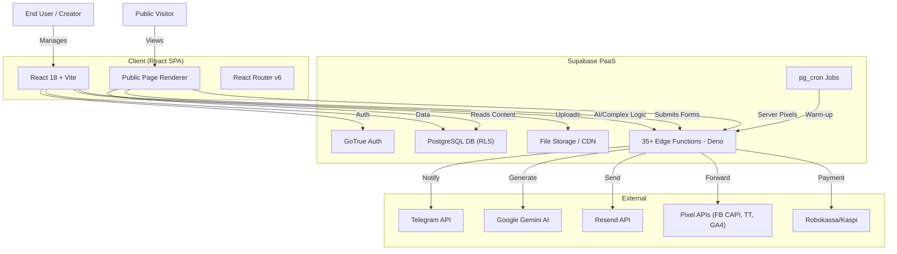

# System Architecture

lnkmx follows a **serverless, client-heavy architecture** built on **React (Vite)** and **Supabase (BaaS)**. The frontend handles UI, routing, and state, while Supabase provides auth, database, storage, and edge functions.

## High-Level Overview

## Core Components

### 1. Frontend Application (`src/`)
Built with **React 18** + **Vite 6** + **TypeScript**.
- **Architecture**: Modular structure following domain-driven principles.
- **State Management**: React Query (server state) + React Context (client state).
- **Routing**: `react-router-dom` v6 (Client-side routing).
- **Styling**: Tailwind CSS + shadcn/ui.
- **i18n**: `react-i18next` with 100% sync reached for RU/EN/KK/UZ (Feb 2026).

**Key Directories:**
- `pages/`: Route-level active components.
- `domain/`: Business entities and logic.
- `platform/`: Specific integrations (Supabase, Robokassa).
- `services/`: API clients and externals.
- `hooks/`: React integration layers (60+ hooks).
- `components/`: UI implementation (blocks, dashboard, editor, analytics).

### 2. Backend / Database
Hosted on **Supabase**.
- **PostgreSQL**: Primary data store with RLS enforced on all tables.
- **RLS (Row Level Security)**: Critical security layer ensuring cross-tenant isolation.
- **pg_cron**: Scheduled jobs for edge function warm-up and automated reminders.

### 3. Edge Functions (35+ total)
Stateless server-side logic running on **Deno**.
- **AI**: Content generation and translation via Gemini.
- **Fintech**: Robokassa integration and webhook handling.
- **Notifications**: Multi-channel alerts (Telegram, Email).
- **SEO/Analytics**: `seo-ssr` for robots and `pixel-proxy` for server-side events.

---

*Last updated: 2026-02-23*
*Reference: See [PLATFORM_SNAPSHOT.md](./PLATFORM_SNAPSHOT.md) for the technical source of truth.*
