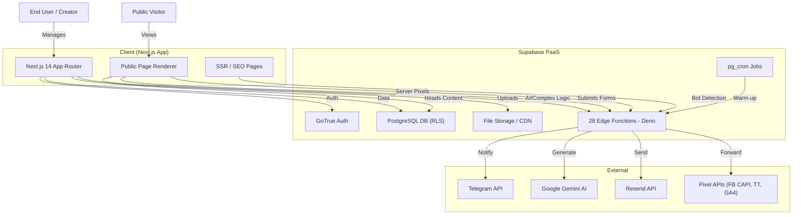

# System Architecture

lnkmx follows a **serverless, client-heavy architecture** built on Next.js and Supabase (BaaS). The frontend handles UI, routing, and state, while Supabase provides auth, database, storage, and edge functions.

## High-Level Overview

## Core Components

### 1. Frontend Application (`src/`)
Built with **Next.js 14** (App Router) + **TypeScript**.
- **Architecture**: Modular Monolith with domain-driven structure.
- **State Management**: React Query (server state) + React Context (client state).
- **Routing**: Next.js file-system routing (App Router with `app/` directory).
- **Styling**: Tailwind CSS + shadcn/ui.
- **i18n**: `react-i18next` with RU/EN/KK support.

> **Note**: `vite.config.ts` still exists for compatibility (`import.meta.env.VITE_*` vars). `next.config.mjs` maps these to `NEXT_PUBLIC_*`.

**Key Directories:**
- `domain/`: Business entities and logic (Clean Architecture/DDD approach).
- `services/`: API clients and externals.
- `hooks/`: React integration layers.
- `components/`: UI implementation (blocks, dashboard, editor, analytics).
- `lib/`: Shared utilities (formatting, logging, block registry).

### 2. Backend / Database
Hosted on **Supabase** (Project ID: `pphdcfxucfndmwulpfwv`).
- **PostgreSQL**: Primary data store with 20+ tables.
- **RLS (Row Level Security)**: Enforced on all tables — users only access their own data.
- **Realtime**: Used for immediate updates on the dashboard (new lead alerts).
- **pg_cron**: Scheduled jobs (edge function warm-up every 4 min, weekly digests, booking reminders).
- **pg_net**: Async HTTP calls from SQL (used by warm-up cron).

### 3. Edge Functions (28 total)
Stateless server-side logic running on **Deno** runtime.
- **Why?** Handle secret keys (AI, Telegram, Pixel APIs) and complex validation.
- **Triggers**: HTTP requests (from client), database webhooks, cron schedules.
- **Warm-up**: `?warmup=true` parameter on critical functions returns 200 OK immediately.

Categories:
- **AI**: `ai-content-generator`, `chatbot-stream`, `translate-content`
- **Notifications**: `send-lead-notification`, `send-booking-notification`, `send-event-confirmation`, `send-booking-reminder`, `send-weekly-digest`, `send-weekly-motivation`, `send-trial-ending-notification`
- **Telegram**: `telegram-bot-webhook`, `validate-telegram`, `telegram-password-reset`
- **Social**: `send-collab-notification`, `send-friend-notification`, `send-social-notification`, `send-team-notification`, `send-attendee-email`
- **Analytics**: `pixel-proxy` (server-side FB CAPI / TikTok / GA4)
- **Other**: `create-lead`, `generate-sitemap`, `seo-ssr`, `google-forms-parser`, `public-experts`, `process-crm-automations`, `resolve-domain`, `seed-demo-accounts`, `language-upload`

## Data Flow: Page Rendering

1. **Request**: Visitor loads `lnkmx.my/username`.
2. **Bot Detection**: If bot/crawler → `seo-ssr` edge function returns full HTML with meta tags.
3. **SPA Load**: If human → Next.js app loads, calls `rpc/get_page_by_slug('username')`.
4. **Security**: DB verifies page is `published` via RLS.
5. **Response**: Returns Page JSON + Blocks JSON.
6. **Render**: `BlockRenderer` iterates through blocks and renders components.
7. **Analytics**: Client-side pixels fire + server-side `pixel-proxy` via `sendBeacon`.

## Security Model

- **Authentication**: JWT tokens managed by Supabase Auth (Google, Apple, Email, Telegram).
- **Authorization**:
    - **Frontend**: UX-level route guards and button hiding.
    - **Backend (Critical)**: RLS policies enforced on every SQL query.
    - **Edge Functions**: Service role key for server-side ops, CORS + rate limiting.
- **Anti-Spam**: Cloudflare Turnstile CAPTCHA on public forms.
- **GDPR**: `export_user_data()` and `delete_user_account()` SQL functions.
- **Cookie Consent**: Analytics gated behind explicit user consent.
- **CSP**: Content Security Policy headers with strict `script-src`.

## Scalability Considerations

- **Read Heavy**: Optimized for high read volume (public pages) vs lower write volume (editors).
- **Caching**: React Query caches data client-side. Public pages leverage Supabase CDN.
- **Cold Start Mitigation**: pg_cron pings critical edge functions every 4 min.
- **Storage**: Media served via CDN-backed Supabase Storage.

---

*Last updated: 2026-02-18*
