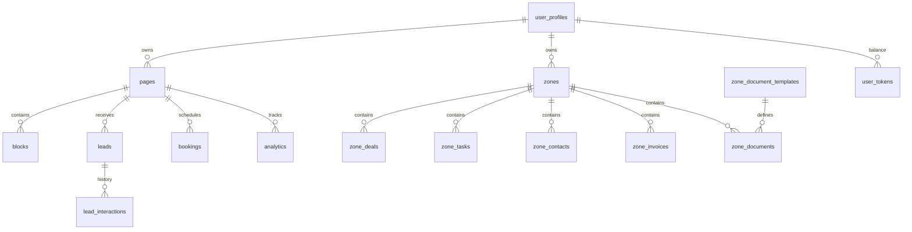

# LinkMAX — Ультимативный гид по платформе (Encyclopedia v2026.07)

> **Last Updated:** July 9, 2026 (Phase 50 Business Zone Command Center)
  
> **Maintained by:** Product & Engineering

Платформа **LinkMAX** — это не просто конструктор персональных страниц. Это полноценная **Business Operating System (Expert OS)**, позиционируемая как **"Anti-Bitrix/AmoCRM"** для экономики независимых специалистов (Solo-Economy). Мы объединили создание сайтов (A/B тесты), управление клиентами (CRM, Kanban, Задачи), аналитику, финансовые инструменты и **Developer Portal (API/Webhooks)** в единую мобильную экосистему с транзакционной моделью монетизации **"Step-by-Growth"**.

---

## 1. Продуктовое видение и стратегия

### 1.1 Миссия и цель

**Миссия**: Стереть границы между маркетингом и операционным управлением для микро-бизнеса. Мы устраняем «налог на инструменты» (необходимость платить за 5+ сервисов), предоставляя унифицированную инфраструктуру «всё-в-одном» за 15 минут.
**Видение**: Стать дефолтной «Identity + Business OS» для каждого специалиста в Центральной Азии и на развивающихся рынках.

### 1.2 Целевые аудитории и решения

| Персона | Проблема/Боли | Решение от lnkmx |
| :--- | :--- | :--- |
| **Beauty-мастер** | Хаос в записях через DM, отсутствие предоплат, клиентская база в блокноте. | Нативный **Booking Block** с календарем + **Portfolio Carousel** + **Services List** + CRM и **Business Zone** (сделки, задачи). |
| **Коуч/Эксперт** | Продажа вебинаров через ручные переводы, разрозненные ссылки на гайды. | **Event Block** (регистрация и билеты) + **Lead Form** + **Digital Product Download** с оплатой. |
| **Риэлтор** | Обезличенные страницы агентств, сложные CRM, потеря персонального бренда. | **Lead Capture** (мгновенные уведомления в TG) + **Property Catalog** + **Business Zone** (Kanban сделок, задачи, контакты) + **Living Canvas**. |

### 1.3 Стратегические столпы

1. **Сложность как грех**: Мы ориентируемся на пользователей, которые являются экспертами в своем деле, а не в ИТ. Пользовательский путь спроектирован так, чтобы страница создавалась без чтения документации.
2. **Дизайн-система "Living Canvas"**: Мы инвестируем в «дизайнерский капитал» пользователя. Высокий уровень визуала (glassmorphism, WebGL, микро-анимации) автоматически повышает доверие к специалисту.

3. **Нативная экосистема**: Мы не интегрируемся с Calendly — мы заменяем его. Это позволяет нам владеть данными по всей воронке (от клика до оплаты).

---

## 2. Основные модули и Технические спецификации

### 2.1 AI Page Builder

Ядро системы, использующее динамический диспетчер блоков `BlockRenderer.tsx`.

- **AI-Onboarding**: Использует Google Gemini для анализа ниши. Промпты жестко ограничены для исключения галлюцинаций.
- **Auto-save**: Zustand-state синхронизируется с БД с дебаунсом. Используется Request Versioning для предотвращения перезаписи старыми данными.
- **Multilingual**: 4 синхронизированных языка (RU, EN, KK, UZ). Еще 12 языков (DE, UK, BE, ES, FR, IT, PT, ZH, TR, JA, KO, AR — lazy). Все строковые поля блоков поддерживают мультиязычность.

- **Leads**: Система статусов `new -> contacted -> qualified -> won/lost`. Единый инбокс для лидов, бронирований и регистраций на события.
- **Business Zone (Zones)**: Рабочие пространства с изоляцией по `zone_id`. **Command Center** на главном экране собирает health score, фокус дня, очередь работ, карту активации и next actions из существующих сделок, задач, контактов, инвойсов и активностей. **Kanban** сделок, **Tasks** (доска с приоритетами, сроками, ответственными, чеклистами), **Contacts**, **Invoices** (счета с автоматической нумерацией), **EDO** (генерация актов и договоров по шаблонам). RBAC через БД.
- **CRM Hardening**: Реализация мягкого удаления (`deleted_at`) для сделок и задач для предотвращения потери данных.
- **Developer Portal (Zenith)**: Полноценный API (`lk_live_` токены) и Webhooks для автоматизации внешних систем пользователями тарифа Pro.

- **Notifications**: Edge-функции отправляют PUSH в Telegram-бот при новом лиде/бронировании.

### 2.2 Business Zone Command Center

**Product Design**: Главный экран зоны должен отвечать не “сколько данных есть”, а “что владельцу делать сейчас”. Phase 50 переводит Business Zone из набора CRM-разделов в ежедневный операционный центр для микро-бизнеса.

**UX Flow**: Пользователь открывает `/dashboard/zone-dashboard`, видит health score, риски дня, деньги в работе, сделки без следующего шага, очередь работ и карту активации. Любое действие ведет в уже существующий рабочий экран: Deals, Tasks, Contacts, Invoices или Automations.

**Database Design**: Новые таблицы не добавлены. Командный слой строится на текущих сущностях `zone_deals`, `zone_tasks`, `zone_contacts`, `zone_invoices`, `zone_deal_activities` и их существующей изоляции по `zone_id`.

**Backend & API**: Edge Functions и Public API не расширялись в этой итерации. Событийная модель остается прежней: изменения в сделках и контактах уже могут запускать `run-zone-automations`, а платежные события остаются в finance/invoice контуре.

**Frontend**: Расширен только `src/components/zones/ZoneDashboard.tsx`; используются существующие React Query hooks `useZoneDeals`, `useZoneTasks`, `useZoneContacts`, `useZoneInvoices` и текущие dashboard routes.

**Security**: RBAC/RLS не менялись. Компонент читает те же данные, которые пользователь уже может видеть в отдельных разделах зоны.

**Performance**: Все агрегаты считаются локально через `useMemo` поверх уже загруженных query results. При росте зоны следующий шаг — серверные summary views/RPC, но только как расширение текущей схемы `zone_id`.

**Backward Compatibility**: Существующие URL, хуки, таблицы, автоматизации и жизненный цикл инвойсов сохраняют совместимость; command center добавлен как расширение UI.

### 2.3 Advanced Analytics (Pixel Proxy)

- **CAPI Integration**: Серверная отправка событий в Facebook CAPI и TikTok Events API для обхода блокировщиков (Ad-blockers).
- **Insights**: CTR по блокам, источники трафика, география; A/B эксперименты по вариантам блоков.

### 2.4 Fintech Ledger (Step-by-Growth)

- **Monetization Engine**: Реализация модели "Step-by-Growth".
  - **Identity (Free)**: Базовая визитка.
  - **Starter (Success-First)**: 0$ / мес + 7% комиссия с транзакций.
  - **Pro (Business OS)**: ~6.5$ / мес + 1% комиссия.
- **Fintech Core (Ledger)**: Операции записываются в `user_wallets`, `wallet_transactions` и `ledger_logs`. Платформа Robokassa и Kaspi QR интегрированы для автоматического списания комиссий.
- **Secure Payouts**: Система мониторинга и выплат с фрод-контролем на уровне Edge Functions.

### 2.5 SEO и индексация

- **Bot detection**: Cloudflare Worker направляет ботов на Supabase Edge Functions (`seo-ssr`, `generate-sitemap`).
- **Pre-render**: Лендинг, галерея, профили экспертов — HTML для роботов. JSON-LD и GEO-схемы.
- **Sitemap**: Динамическая генерация (10k+ URL).

---

## 3. Архитектура и Инфраструктура

### 3.1 Технологический стек

- **Frontend**: React 18.3, Vite 6, TypeScript 5.8. React Router 6 (lazy routes). TanStack Query 5 (defaults: staleTime 5 min, gcTime 10 min).
- **State**: Zustand (Editor), React Query (Server cache).
- **Backend**: Supabase (Postgres, Auth, Storage). 28+ Edge Functions (Deno).
- **SSR/Bots**: Cloudflare Worker (prerender, sitemap).
- **Mobile**: Capacitor 8 (iOS/Android).
- **Monitoring**: Sentry, Web Vitals. Централизованный logger (dev/prod).

### 3.2 Схема данных (Core Entities)

### 3.3 Критические Edge Functions (28+)

| Функция | Задача | Триггер |
| :--- | :--- | :--- |
| `ai-content-generator` | Генерация контента страницы | UI Dashboard |
| `seo-ssr` | Предрендеринг для ботов (SSR) | Запрос от робота |
| `generate-sitemap` | Генерация sitemap | Запрос от робота/кроулера |
| `pixel-proxy` | Серверная отправка аналитики | События на странице |
| `create-lead` | Валидация и сохранение лида | Форма на странице |
| `send-lead-notification` | Уведомление в Telegram | После создания лида |
| `telegram-bot-webhook` | Обработка команд в боте | Сообщение в ТГ |
| *+ ещё 21 функция* | Уведомления, рассылки, букинг, события, CRM | См. `supabase/config.toml` |

---

## 4. Дизайн-система "Liquid Glass"

Дизайн lnkmx — наш главный Moat.

- **Glassmorphism**: `backdrop-blur-xl`, полупрозрачные фоны (`bg-white/10`), тонкие границы (`border-white/20`).
- **Design Tokens**: `shadow-glass`, `text-gradient`. Адаптивный container padding (1rem / 1.5rem / 2rem).
- **Animations**: CSS-переменные, Framer Motion для переходов. Поддержка `prefers-reduced-motion`. Skip-to-content для a11y.

---

## 5. Реестр блоков

28+ типов блоков: Profile, Link, Button, Social, Booking, Event, Lead Form, Products, Carousel, Video, Newsletter, Scratch, Custom Code, Experts, Gallery, и др. Часть блоков премиум. Все блоки проходят TypeCheck и поддерживают мультиязычность. Стандарт: Unit Tests и MultilingualString.

---

## 6. Продуктовый роадмап 2026

### Q1 2026 (выполнено)

- Платформа, 28+ блоков, Auth (Google/Apple/Telegram), PWA с shortcuts.
- Business Zone (CRM, Kanban, Tasks, Contacts), Pixel Proxy, A/B тесты.
- SEO/SSR (Cloudflare + Supabase), 16 языков, Sentry, Web Vitals.

### Q2 2026: Success-First Launch

- **Starter Tier**: Запуск транзакционной модели 7%.
- **Payments**: Полная интеграция Kaspi QR и Robokassa (автоматизация сплитов).
- **Mobile**: Нативные приложения (Capacitor iOS/Android).

### Q3 2026: CRM Mastery

- **Custom Fields**: Гибкая настройка карточек клиентов.
- **Advanced Export**: Отчеты в Excel/PDF.
- **Zapier/Make**: Открытие API для интеграций.

### Q4 2026: Global Fintech Pivot

- **Internal Wallet**: Прямые выплаты и внутренний баланс.
- **Digital Goods**: Магазин цифровых товаров.
- **AI Financial Advisor**: Автоматический аудит доходов/расходов.

---

## 7. Безопасность и Операции

- **RLS**: Все таблицы защищены политиками по `auth.uid()` / `zone_id`.
- **Edge Functions**: В `config.toml` для каждой функции задокументировано использование `verify_jwt` (public/cron/webhook vs authenticated).
- **Runbook**: SEV-1/2/3, Status Page, Content Moderation (Google Vision, report-based).

---

## 8. Быстрый старт разработчика

1. **Клонирование**: `git clone <url>`
2. **Зависимости**: `npm install`
3. **Окружение**: Скопировать `.env.example` в `.env`, задать Supabase URL и keys (и при необходимости `VITE_APP_DOMAIN`).
4. **Запуск**: `npm run dev` — приложение на **<http://localhost:8080>**
5. **Тесты**: `npm run test`, `npm run e2e` (Playwright на порту 8080).

---

*Документ обновлен: 7 марта 2026 г.*  
*Maintained by: Product & Engineering*
