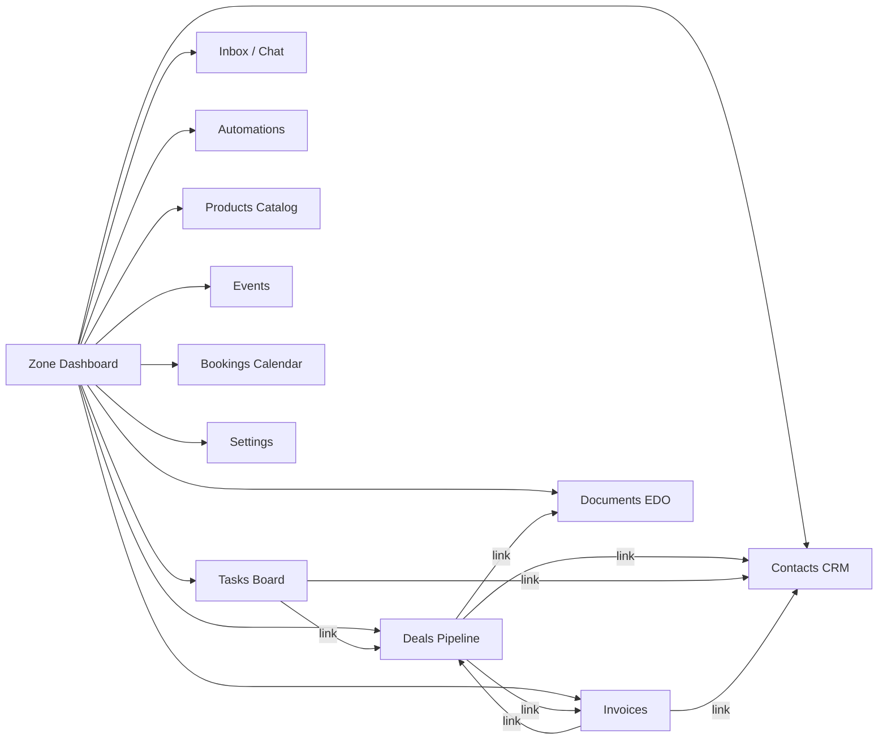

# 🔍 Аудит Бизнес-Зоны lnkmx — 2026-03-07

> **Тип**: Комплексный аудит бизнес-модуля  
> **Область**: Структура, код, UX, дизайн, адаптивность, функционал  
> **Конкуренты для сравнения**: Bitrix24, amoCRM, Pipedrive, HubSpot CRM  
> **Дата**: 7 марта 2026

---

## 📊 Executive Summary

Бизнес-зона lnkmx — полноценный мини-CRM, встроенный в платформу для соло-предпринимателей. Модуль покрывает **12 функциональных экранов** (~4 600 строк UI-кода), что сопоставимо по набору функций с бесплатным тарифом Bitrix24 или Pipedrive Essential. Однако имеются **критические пробелы** в UX, отсутствии аналитики/отчётов, и ряд архитектурных недочётов, которые ограничивают конкурентоспособность.

### Общая оценка по областям

| Область | Оценка | Уровень |
| :--- | :---: | :--- |
| **Структура кода** | ⭐⭐⭐⭐ | Хорошо |
| **Типизация** | ⭐⭐⭐⭐⭐ | Отлично |
| **UX / Юзабилити** | ⭐⭐⭐ | Удовлетворительно |
| **Дизайн** | ⭐⭐⭐⭐ | Хорошо |
| **Адаптивность** | ⭐⭐⭐ | Удовлетворительно |
| **Функциональная полнота** | ⭐⭐⭐ | Удовлетворительно |
| **Конкурентоспособность** | ⭐⭐⭐ | Средняя |

---

## 1. Структура и архитектура кода

### 1.1 Общая архитектура

```
src/components/zones/           ← 12 экранов + субкомпоненты
src/hooks/zones/                ← 12 React Query хуков
src/contexts/ZoneContext.tsx    ← Центральный контекст
src/types/zones.ts              ← 298 строк типов
```

**Сильные стороны:**

- ✅ **Lazy loading**: Все 12 экранов загружаются через `React.lazy()` в `ZoneWrappers.tsx` — отличное code-splitting
- ✅ **Строгая типизация**: `zones.ts` содержит 20+ интерфейсов, покрывающих все сущности (Zone, ZoneMember, ZoneDeal, ZoneTask, ZoneInvoice, ZoneDocument и т.д.)
- ✅ **Паттерн Wrapper**: Каждый экран обёрнут в wrapper-компонент, который читает `ZoneContext` — чистое разделение ответственности
- ✅ **React Query**: Все данные загружаются через кастомные хуки (`useZoneDeals`, `useZoneContacts` и т.д.)
- ✅ **Мемоизация**: Активное использование `memo`, `useMemo`, `useCallback` в критических компонентах

**Проблемы:**

- ⚠️ **ZoneContext слишком тонкий (37 строк)**: Контекст хранит только `currentZoneId` и делегирует всё в `useZones()`. Нет кеширования, нет оптимистичных обновлений
- ⚠️ **Дублирование паттерна фильтрации**: `ZoneDealsScreen`, `ZoneContactsScreen` и `ZoneTasksScreen` реализуют **одинаковый** паттерн «preset filters → localStorage». Это должно быть вынесено в общий хук `useFilterPresets(storageKey)`
- ⚠️ **Использование `useMemo` с side-effects**: В `ZoneContactsScreen` (строка 64) и `ZoneDealsScreen` (строка 82) `useMemo` используется для чтения `localStorage` с вызовом `setState` внутри — это анти-паттерн React
- ⚠️ **Отсутствие Error Boundaries**: Ни один экран не обёрнут в Error Boundary — падение одного экрана может уронить весь workspace

### 1.2 Размер компонентов

| Компонент | Строк | Оценка |
| :--- | ---: | :--- |
| `ZoneDealsScreen.tsx` | 623 | ⚠️ Превышает рекомендуемый лимит (400), требует рефакторинга |
| `ZoneBookingsCalendarScreen.tsx` | 562 | ⚠️ Большой, но оправданно (календарь) |
| `ZoneSettingsScreen.tsx` | 489 | ⚠️ На грани, можно разделить на подкомпоненты |
| `ZoneContactsScreen.tsx` | 452 | ✅ Приемлемо |
| `ZoneInvoicesScreen.tsx` | 382 | ✅ Приемлемо |
| `ZoneDashboard.tsx` | 368 | ✅ Приемлемо |
| `ZoneAutomationsScreen.tsx` | 359 | ✅ Приемлемо |
| `ZoneEventsScreen.tsx` | 322 | ✅ Приемлемо |
| `ZoneTasksScreen.tsx` | 314 | ✅ Приемлемо |
| `ZoneInboxScreen.tsx` | 309 | ✅ Приемлемо |
| `ZoneProductsScreen.tsx` | 270 | ✅ Приемлемо |
| `ZoneDocumentsScreen.tsx` | 177 | ✅ Лёгкий |

### 1.3 Subcomponents (глубина)

```
zones/
├── deals/
│   ├── DealCard.tsx
│   ├── DealDetailSheet.tsx
│   └── DealKanbanColumn.tsx
├── contacts/
│   ├── ContactDetailSheet.tsx
│   └── ContactImportDialog.tsx
├── tasks/
│   ├── TaskCard.tsx
│   ├── TaskDetailSheet.tsx
│   └── TaskKanbanColumn.tsx
└── documents/
    ├── ZoneDocumentCreator.tsx
    └── ZoneDocumentsScreen.tsx
```

> ✅ Хорошая декомпозиция для Deals и Tasks (Kanban). ⚠️ Invoices и Events не имеют субкомпонентов, что может указывать на недостаточную сложность или монолитность.

---

## 2. UX / Юзабилити

### 2.1 Навигация

**Текущее состояние:**

- Все экраны доступны через боковое меню зоны в Dashboard
- Переключение зон через `ZoneSwitcher`
- Lazy loading обеспечивает быструю загрузку

**Проблемы vs конкуренты:**

| Функция | lnkmx | Bitrix24 | Pipedrive | amoCRM |
| :--- | :---: | :---: | :---: | :---: |
| Поиск (глобальный) по всем сущностям | ❌ | ✅ | ✅ | ✅ |
| Быстрые действия (Cmd+K) | ❌ | ❌ | ✅ | ❌ |
| Breadcrumbs / навигация назад | ❌ | ✅ | ✅ | ✅ |
| Вкладки / мульти-панели | ❌ | ✅ | ✅ | ❌ |
| Уведомления в реальном времени | ✅ (bell) | ✅ | ✅ | ✅ |

> **Критичный пробел**: Отсутствие **глобального поиска** по контактам, сделкам, задачам. В Bitrix24 и Pipedrive это базовая функция.

### 2.2 Workflow сделок (Deals)

**Сильные стороны:**

- ✅ Kanban с drag-and-drop через `@dnd-kit/core`
- ✅ Поддержка touch-сенсоров для мобильных
- ✅ Won/Lost dialog при перетаскивании на последнюю стадию
- ✅ Фильтры: по исполнителю, дате, сумме, просрочке
- ✅ Сохранение фильтр-пресетов в localStorage

**Недостатки vs конкуренты:**

| Функция | lnkmx | Bitrix24 | Pipedrive | HubSpot |
| :--- | :---: | :---: | :---: | :---: |
| Множественные пайплайны | ❌ | ✅ | ✅ | ✅ |
| Рекурррентные сделки | ❌ | ✅ | ✅ | ❌ |
| Прогноз продаж (forecast) | ❌ | ✅ | ✅ | ✅ |
| Обязательные поля по стадиям | ❌ | ✅ | ✅ | ✅ |
| Массовые действия (bulk) | ❌ | ✅ | ✅ | ✅ |
| Связь Сделка → Счёт → Документ | ✅ | ✅ | Add-on | ✅ |
| История изменений (audit log) | ⚠️ basic | ✅ | ✅ | ✅ |
| Привязка продуктов к сделке | ✅ | ✅ | ✅ | ✅ |

### 2.3 Контакты (CRM)

**Сильные стороны:**

- ✅ Поиск по имени, телефону, email
- ✅ Теги для сегментации
- ✅ Импорт контактов (CSV/JSON через `ContactImportDialog`)
- ✅ Карточка контакта с детальной информацией (Sheet)
- ✅ Поля: company, position, telegram, address, source, notes

**Недостатки vs конкуренты:**

| Функция | lnkmx | Bitrix24 | amoCRM | HubSpot |
| :--- | :---: | :---: | :---: | :---: |
| Дедупликация контактов | ❌ | ✅ | ✅ | ✅ |
| Связь с компаниями (Company entity) | ❌ (поле) | ✅ (entity) | ✅ | ✅ |
| Настраиваемые поля (Custom fields) | ❌ | ✅ | ✅ | ✅ |
| Импорт из Telegram/WhatsApp | ❌ | ✅ | ✅ | ❌ |
| История взаимодействий (timeline) | ❌ | ✅ | ✅ | ✅ |
| Массовые действия (bulk edit/delete) | ❌ | ✅ | ✅ | ✅ |
| Экспорт контактов | ❌ | ✅ | ✅ | ✅ |

### 2.4 Задачи (Tasks)

**Сильные стороны:**

- ✅ Kanban board с DnD по статусам (todo / in_progress / done / cancelled)
- ✅ Приоритеты: low / medium / high / urgent
- ✅ Привязка к контакту, сделке, исполнителю
- ✅ Due date с отслеживанием просрочек
- ✅ Чеклисты (checklist items)

**Недостатки vs конкуренты:**

| Функция | lnkmx | Bitrix24 | Pipedrive | HubSpot |
| :--- | :---: | :---: | :---: | :---: |
| Gantt chart | ❌ | ✅ | ❌ | ❌ |
| Зависимости задач | ❌ | ✅ | ❌ | ❌ |
| Календарь задач (отдельный) | ❌ | ✅ | ✅ | ✅ |
| Подзадачи (nested) | ❌ | ✅ | ❌ | ❌ |
| Повторяющиеся задачи | ❌ | ✅ | ✅ | ✅ |
| Трек времени (time tracking) | ❌ | ✅ | ❌ | ❌ |
| Комментарии к задачам | ❌ | ✅ | ✅ | ✅ |

### 2.5 Счета / Инвойсы

**Сильные стороны:**

- ✅ Multi-item invoice support
- ✅ Автоматическая нумерация (`invoice_number`)
- ✅ Привязка к сделке и контакту
- ✅ Статусы: created / paid / failed / expired
- ✅ Robokassa интеграция (pay_url)

**Недостатки vs конкуренты:**

| Функция | lnkmx | Bitrix24 | Pipedrive | HubSpot |
| :--- | :---: | :---: | :---: | :---: |
| PDF генерация | ❌ | ✅ | ✅ | ✅ |
| Шаблоны инвойсов | ❌ | ✅ | ✅ | ✅ |
| Мульти-валюта | ⚠️ Поле есть | ✅ | ✅ | ✅ |
| Повторяющиеся инвойсы | ❌ | ✅ | ✅ | ✅ |
| Онлайн оплата (встроенная) | ✅ (Robokassa) | ✅ | Add-on | ✅ |
| Частичная оплата | ❌ | ✅ | ❌ | ❌ |
| Налоги и скидки | ❌ | ✅ | ✅ | ✅ |
| Отправка по email | ❌ | ✅ | ✅ | ✅ |

---

## 3. Дизайн и визуальное оформление

### 3.1 Дизайн-система

| Characteristic | Implementation | Quality |
| :--- | :--- | :--- |
| Glassmorphism | `bg-background/40 backdrop-blur-sm border-border/40` | ✅ Единообразно |
| Цветовая палитра | HSL tokens через Tailwind CSS variables | ✅ Консистентно |
| Иконки | Lucide React (tree-shakable imports) | ✅ Лёгкие |
| Charts | Recharts (`BarChart`, `ResponsiveContainer`) | ✅ Функционально |
| Glassmorphism cards | `MetricCard` с hover/border эффектами | ✅ Premium feel |
| Typography | `text-[10px]`, `text-xs`, uppercase tracking | ⚠️ Слишком мелко |

**Проблемы:**

- ⚠️ **Слишком мелкий шрифт**: Массовое использование `text-[10px]` — это **8px** реальных, что ниже WCAG AA рекомендаций (12px минимум). Это критичная проблема для Accessibility
- ⚠️ **Нет тёмной/светлой темы toggle**: Цвета адаптивны (HSL variables), но нет UI для переключения
- ⚠️ **Отсутствие skeleton animations при lazy load**: При переключении между экранами нет Suspense fallback с анимацией (только в некоторых экранах)

### 3.2 Сравнение дизайна с конкурентами

| Аспект | lnkmx | Bitrix24 | Pipedrive | amoCRM |
| :--- | :--- | :--- | :--- | :--- |
| **Стиль** | Glassmorphism (Liquid Glass) | Corporate flat | Clean minimal | Corporate dark |
| **Wow-эффект** | ⭐⭐⭐⭐ | ⭐⭐ | ⭐⭐⭐ | ⭐⭐⭐ |
| **Информационная плотность** | ⭐⭐⭐ | ⭐⭐⭐⭐⭐ | ⭐⭐⭐⭐ | ⭐⭐⭐ |
| **Accessibility** | ⭐⭐ | ⭐⭐⭐ | ⭐⭐⭐⭐ | ⭐⭐⭐ |
| **Единообразие** | ⭐⭐⭐⭐ | ⭐⭐⭐ | ⭐⭐⭐⭐⭐ | ⭐⭐⭐⭐ |

> **Конкурентное преимущество**: Liquid Glass aesthetic выглядит значительно премиальнее конкурентов, что важно для восприятия ценности продукта. Однако это не должно идти в ущерб читаемости.

---

## 4. Адаптивность (Mobile/Responsive)

### 4.1 Текущая реализация

| Экран | Адаптивность | Комментарий |
| :--- | :---: | :--- |
| Dashboard | ✅ | `grid-cols-2 md:grid-cols-4`, `lg:grid-cols-3` |
| Deals Kanban | ⚠️ | Горизонтальный скролл `overflow-x-auto`, но столбцы не удобны на <375px |
| Contacts | ✅ | `flex-wrap`, адаптивный поиск |
| Tasks Kanban | ⚠️ | Аналогично Deals — Kanban на мобиле требует горизонтального скролла |
| Invoices | ✅ | Списковый layout, работает хорошо |
| Inbox | ✅ | Двухпанельный с `hidden md:block` — mobile-first |
| Calendar | ⚠️ | Недельный вид с 15 часами не умещается |
| Settings | ✅ | Tab-based, работает |
| Events | ✅ | Карточный layout |
| Documents | ⚠️ | Простой список, мало адаптивных утилит |

### 4.2 Ключевые проблемы адаптива

1. **Kanban на мобиле**: Горизонтальный скролл колонок — стандартный подход, но конкуренты (amoCRM, Pipedrive) предоставляют **вертикальный список** как альтернативу на мобиле
2. **Высота `h-[calc(100vh-80px)]`**: Жёстко привязана к header height — ломается при использовании в PWA с Safe Area Insets
3. **Calendar Week View**: 15 строк × 7 столбцов не помещается на мобиле без скролла в обоих направлениях
4. **Touch targets**: Кнопки с `size="sm"` и текст `text-[10px]` — нарушают Apple HIG (минимум 44x44pt) и Material Design (48dp)

### 4.3 Сравнение с конкурентами

| Функция | lnkmx | Bitrix24 | Pipedrive | amoCRM |
| :--- | :---: | :---: | :---: | :---: |
| PWA | ✅ | ✅ | ❌ | ❌ |
| Нативное мобильное приложение | ⚠️ Capacitor | ✅ | ✅ | ✅ |
| Offline mode | ❌ | ✅ | ✅ | ❌ |
| Push notifications | ⚠️ Web only | ✅ | ✅ | ✅ |
| Swipe actions | ❌ | ✅ | ✅ | ✅ |
| Bottom sheet navigation | ❌ | ✅ | ❌ | ✅ |

---

## 5. Функциональная полнота

### 5.1 Карта модулей



### 5.2 Что есть (✅) vs что критически отсутствует (❌)

| Категория | Функция | Статус | Приоритет |
| :--- | :--- | :---: | :---: |
| **CRM** | Контакты | ✅ | — |
| | Компании (отдельная сущность) | ❌ | 🔴 High |
| | Сделки (Kanban) | ✅ | — |
| | Множественные пайплайны | ❌ | 🔴 High |
| | Прогноз продаж | ❌ | 🟡 Medium |
| | Дашборд аналитики | ✅ | — |
| **Коммуникации** | Team Inbox | ✅ | — |
| | Email интеграция | ❌ | 🔴 High |
| | WhatsApp бот | ❌ | 🟡 Medium |
| | Телефония (VoIP) | ❌ | 🟡 Medium |
| | Push уведомления (mobile) | ❌ | 🔴 High |
| **Задачи** | Kanban board | ✅ | — |
| | Чеклисты | ✅ | — |
| | Повторяющиеся задачи | ❌ | 🟡 Medium |
| | Комментарии к задачам | ❌ | 🟡 Medium |
| **Финансы** | Инвойсы | ✅ | — |
| | PDF генерация | ❌ | 🔴 High |
| | Налоги / скидки | ❌ | 🟡 Medium |
| | Отчёт P&L | ❌ | 🟡 Medium |
| **Документооборот** | Шаблоны документов | ✅ | — |
| | Генерация из шаблонов | ✅ | — |
| | Электронная подпись | ❌ | 🟢 Low |
| **Автоматизации** | Триггеры (deal_stage, invoice_paid) | ✅ | — |
| | Действия (уведомление, задача) | ✅ | — |
| | Визуальный редактор автоматизаций | ❌ | 🟡 Medium |
| | Вебхуки наружу | ❌ | 🟡 Medium |
| **Отчётность** | Финансовый отчёт | ❌ | 🔴 High |
| | Воронка продаж аналитика | ⚠️ Basic | 🔴 High |
| | Отчёт по задачам | ❌ | 🟡 Medium |
| | Экспорт данных (CSV/Excel) | ❌ | 🔴 High |
| **Интеграции** | Robokassa | ✅ | — |
| | Telegram Bot | ✅ | — |
| | Google Calendar Sync | ❌ | 🟡 Medium |
| | 1С интеграция | ❌ | 🟡 Medium |

---

## 6. Конкурентный анализ (Feature Matrix)

### 6.1 Общее поагтурное сравнение

| Fеатуре | **lnkmx Zone** | **Bitrix24 Free** | **Pipedrive Essential** | **amoCRM Base** | **HubSpot Free** |
| :--- | :---: | :---: | :---: | :---: | :---: |
| **Цена (мес)** | от 3 045 ₸ | 0 ₸ (5 чел) | ~$14/user | ~$15/user | 0 |
| **Лимит пользователей** | 5–∞ | 5 (free) | ∞ | ∞ | ∞ |
| Deals Kanban | ✅ | ✅ | ✅ | ✅ | ✅ |
| Contacts | ✅ | ✅ | ✅ | ✅ | ✅ |
| Tasks | ✅ | ✅ | ✅ | ⚠️ | ✅ |
| Invoices | ✅ | ✅ | Add-on | ❌ | ✅ |
| Documents/EDO | ✅ | ✅ | ❌ | ❌ | ❌ |
| Team Inbox | ✅ | ✅ | ❌ | ✅ | ✅ |
| Automations | ✅ | ✅ | ✅ | ✅ | ⚠️ |
| Calendar | ✅ | ✅ | ✅ | ❌ | ✅ |
| Events | ✅ | ❌ | ❌ | ❌ | ❌ |
| Products Catalog | ✅ | ✅ | ✅ | ❌ | ✅ |
| Page Builder | ✅ (уникально) | ✅ (Сайт24) | ❌ | ❌ | ✅ (CMS) |
| AI Generation | ✅ (уникально) | ✅ (CoPilot) | ✅ | ❌ | ✅ |
| Analytics Pixel | ✅ (уникально) | ❌ | ❌ | ❌ | ✅ |

### 6.2 Уникальные преимущества lnkmx

1. **Page Builder + CRM в одном**: Ни один конкурент (кроме Bitrix24 Сайт24) не даёт конструктор лендингов + CRM. У lnkmx это нативно интегрировано
2. **AI-генерация контента**: Создание страниц через AI — отсутствует в amoCRM и Pipedrive
3. **Server-side Analytics (Pixel Proxy)**: FB CAPI, TikTok, GA4 — уникальная функция для маркетинга
4. **Events + Bookings**: Полноценное управление мероприятиями и записью — недоступно в Pipedrive/amoCRM
5. **Liquid Glass Design**: Визуально премиальный дизайн, выделяющийся из корпоративного стиля конкурентов
6. **i18n (4 языка)**: RU/EN/KK/UZ — важно для рынка СНГ

### 6.3 Критические конкурентные разрывы

| Разрыв | Влияние | Все конкуренты имеют |
| :--- | :--- | :---: |
| **Нет глобального поиска** | Пользователь не может быстро найти контакт/сделку | ✅ |
| **Нет экспорта данных** | Невозможно выгрузить базу клиентов | ✅ |
| **Нет email интеграции** | Нет привязки писем к контактам/сделкам | ✅ |
| **Нет множественных пайплайнов** | Невозможно иметь разные воронки для разных продуктов | 3/4 |
| **Нет PDF инвойсов** | Нельзя отправить счёт клиенту | 3/4 |
| **Нет отчётности/аналитики** | Нет отчёта по продажам/финансам | ✅ |
| **Нет custom fields** | Невозможно адаптировать CRM под нишу | ✅ |

---

## 7. Качество кода — точечные находки

### 7.1 Anti-patterns обнаруженные в коде

```typescript
// ❌ ZoneContactsScreen.tsx:64 — useMemo с side-effects (setState внутри)
useMemo(() => {
  try {
    const raw = window.localStorage.getItem(storageKey);
    if (raw) {
      const parsed = JSON.parse(raw);
      setPresets(parsed); // SIDE EFFECT В useMemo!
    }
  } catch { }
}, [storageKey]);
```

**Правильный подход:**

```typescript
// ✅ Использовать useEffect для side-effects
useEffect(() => {
  try {
    const raw = window.localStorage.getItem(storageKey);
    if (raw) setPresets(JSON.parse(raw));
  } catch { }
}, [storageKey]);
```

### 7.2 `crypto.randomUUID` без проверки

```typescript
// ⚠️ ZoneDealsScreen.tsx:118 — Cast через (crypto as any)
id: (typeof crypto !== 'undefined' && (crypto as any).randomUUID)
  ? (crypto as any).randomUUID()
  : Math.random().toString(36).slice(2),
```

**Рекомендация**: Использовать утилиту `generateId()` из общей библиотеки.

### 7.3 Hardcoded strings на русском

```typescript
// ⚠️ ZoneTasksScreen.tsx:30 — Hardcoded русские строки
const PRIORITY_CONFIG: Record<TaskPriority, { label: string }> = {
  low: { label: 'Низкий' },
  medium: { label: 'Средний' },
  high: { label: 'Высокий' },
  urgent: { label: 'Срочный' },
};
```

**Проблема**: Не использует `i18n` — все лейблы должны идти через `t()`.

### 7.4 Непоследовательная обработка ошибок

- `ZoneDealsScreen` — использует `sonner` toast
- `ZoneInboxScreen` — использует `useToast()` из shadcn
- **Необходимо**: стандартизировать на один подход

---

## 8. Рекомендации по приоритетам

### 🔴 P0 — Критические (Sprint 1-2)

1. **Глобальный поиск**: Command palette (Cmd+K) по контактам, сделкам, задачам
2. **Экспорт данных**: CSV/Excel экспорт контактов и сделок  
3. **PDF инвойсы**: Генерация PDF для отправки клиентам
4. **Fix accessibility**: Минимальный шрифт 12px, touch targets 44px
5. **Fix useMemo anti-pattern**: Заменить на useEffect в 2 файлах

### 🟡 P1 — Важные (Sprint 3-5)

1. **Email интеграция**: Привязка email к контактам
2. **Множественные пайплайны**: Несколько воронок продаж
3. **Custom fields**: Настраиваемые поля для контактов и сделок
4. **Отчётность**: Dashboard с метриками продаж/финансов
5. **Повторяющиеся задачи**: Cron-based recurrence

### 🟢 P2 — Желательные (Backlog)

1. Gantt chart для задач
2. Визуальный редактор автоматизаций
3. WhatsApp бот
4. Google Calendar sync
5. Offline mode (PWA)
6. Swipe actions для карточек на мобиле

---

## 9. Итоговая матрица зрелости

```
                    lnkmx Zone       Bitrix24       Pipedrive       amoCRM
                    ──────────       ────────       ─────────       ──────
Deals/Pipeline      ████████░░ 80%   ██████████ 98%  █████████░ 95%  ████████░░ 85%
Contacts CRM        ██████░░░░ 60%   █████████░ 95%  ████████░░ 85%  ████████░░ 80%
Tasks               ███████░░░ 70%   █████████░ 95%  ██████░░░░ 60%  █████░░░░░ 50%
Invoices/Billing    ██████░░░░ 60%   █████████░ 90%  ██████░░░░ 60%  ███░░░░░░░ 30%
Team Collab         ██████░░░░ 60%   █████████░ 95%  █████░░░░░ 50%  ██████░░░░ 60%
Automations         ██████░░░░ 60%   █████████░ 95%  ███████░░░ 75%  ████████░░ 80%
Reporting           ███░░░░░░░ 30%   █████████░ 90%  ████████░░ 85%  ██████░░░░ 60%
Mobile UX           █████░░░░░ 50%   ████████░░ 80%  █████████░ 90%  ████████░░ 85%
Design Premium      █████████░ 90%   █████░░░░░ 50%  ███████░░░ 70%  ██████░░░░ 60%
Unique Features     █████████░ 90%   ███████░░░ 70%  █████░░░░░ 50%  ████░░░░░░ 40%
──────────────      ──────────       ──────────       ──────────       ──────────
ОБЩИЙ SCORE         65%              86%              72%              63%
```

> **Вывод**: lnkmx Zone находится на уровне **MVP+ бизнес-CRM**, сопоставимого с amoCRM базовой версии. Основные конкурентные преимущества — в уникальном сочетании Page Builder + CRM + Analytics + AI. Для достижения уровня Pipedrive необходимо закрыть P0 items (поиск, экспорт, PDF, отчётность). Для уровня Bitrix24 потребуется 6-12 месяцев работы над расширением CRM-функционала.

---

*Аудит выполнен: 2026-03-07 | Автор: Antigravity (Principal Engineer)*
