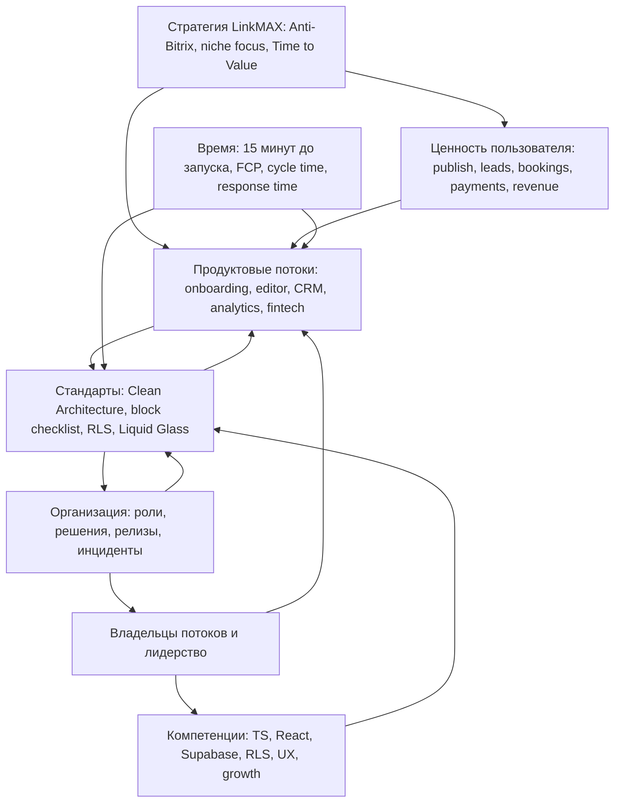

# Кайдзен-система для LinkMAX

> **Статус:** Draft  
> **Дата:** 24 апреля 2026  
> **Основа:** модель кайдзен-системы со слайда, адаптированная под LinkMAX  
> **Источник продуктового контекста:** `docs/PLATFORM_SNAPSHOT.md`  
> **Область:** продукт, разработка, операции, качество, рост, безопасность

---

## 1. Назначение документа

Этот документ адаптирует модель кайдзен-системы под проект **LinkMAX** - mobile-first Business OS для соло-предпринимателей и микробизнеса. Цель адаптации - превратить кайдзен из общей управленческой модели в практический контур ежедневных улучшений для продукта, команды и пользовательских сценариев LinkMAX.

Для LinkMAX кайдзен означает не "больше процессов", а более быстрый и чистый путь к пользовательской ценности:

- быстрее довести нового пользователя до опубликованной страницы;
- проще захватить лид, бронь или платеж;
- надежнее управлять CRM, booking, analytics и fintech-потоками;
- сохранять premium mobile-first UX без лишней сложности;
- снижать технический долг без замедления продуктового роста;
- укреплять безопасность, RLS и архитектурные границы по мере развития платформы.

Кайдзен-система должна поддерживать главный продуктовый принцип LinkMAX: **если действие требует больше 3 кликов или мешает запуску бизнеса за 15 минут, процесс нужно упростить**.

---

## 2. LinkMAX-контекст

LinkMAX развивается из link-in-bio инструмента в полноценный **Micro-Business Operating System**. Платформа объединяет page builder, mini-CRM, booking, analytics, payments, business zones, Telegram operational HQ и AI-помощь в одном mobile-first продукте.

Текущий стратегический вектор:

- позиционирование: **Anti-Bitrix/AmoCRM** для соло-предпринимателей;
- ценность: убрать "tool tax" и "complexity fatigue";
- фокус: быстрый Time to Value для конкретных ниш, начиная с экспертов и консультантов;
- продуктовая ставка: premium Liquid Glass / Living Canvas, AI onboarding, native CRM, native booking, native analytics, Telegram control;
- архитектурная ставка: строгие типы, Clean Architecture, Supabase RLS, Edge Functions, Cloudflare SSR для crawlers, Sentry/Web Vitals.

Поэтому кайдзен-система LinkMAX должна улучшать не абстрактные процессы, а конкретные потоки создания ценности:

1. **Signup -> AI Onboarding -> Page Generated -> Customize -> Publish -> Share -> Track -> Manage Leads**.
2. Создание и развитие блоков редактора.
3. Лиды, CRM, booking, invoices, payments и Telegram-операции.
4. Public pages, SEO, AEO, GEO и bot rendering.
5. Security, RLS, privacy, GDPR, monitoring и performance.
6. Growth, niche landing pages, onboarding и activation.

---

## 3. Модель кайдзен-системы LinkMAX

Исходная модель со слайда состоит из восьми блоков. В LinkMAX они переводятся в продуктово-инженерный контур:

| Блок модели | Адаптация для LinkMAX | Главный вопрос |
| :--- | :--- | :--- |
| Разработка стратегии | Product strategy, niche focus, roadmap, monetization, North Star. | Какое улучшение быстрее приближает пользователя к работающему бизнесу? |
| Развитие процессов | Value streams: onboarding, editor, publish, CRM, booking, payments, analytics, releases. | Где пользователь, команда или система теряют время, качество или деньги? |
| Развитие лидера и мотивация | Владельцы потоков, ясные решения, автономия команды, связь задач с бизнес-результатом. | Кто отвечает за улучшение и как он узнает, что оно сработало? |
| Развитие компетенций | TypeScript, React, Supabase/RLS, product UX, mobile-first design, analytics, security. | Хватает ли команде навыков, чтобы безопасно развивать Business OS? |
| Стандартизация и стабилизация | Clean Architecture, block checklist, RLS policy checklist, design rules, release gates. | Как закрепить лучший способ работы без бюрократии? |
| Ценностно-ориентированный подход | Publish faster, capture leads, manage clients, accept bookings/payments, grow revenue. | Как это улучшение помогает пользователю заработать или сэкономить время? |
| Время | Time to Value, lead response time, release cycle time, FCP/LCP, incident recovery. | Где задержка сильнее всего ломает ценность LinkMAX? |
| Организация | Product/Eng/Growth/Ops ownership, decision rights, incident roles, documentation. | Понятно ли, кто принимает решение и кто доводит изменение до результата? |



---

## 4. Продуктовые потоки для кайдзен-улучшений

Кайдзен в LinkMAX должен быть организован вокруг потоков, которые напрямую влияют на пользовательскую ценность.

| Поток | Что улучшаем | Типичные потери | Целевой результат |
| :--- | :--- | :--- | :--- |
| Activation и onboarding | Signup, AI wizard, niche presets, первый publish. | Пользователь не понимает следующий шаг, долго заполняет данные, бросает wizard. | Пользователь получает рабочую страницу и первый CTA максимально быстро. |
| Editor и blocks | Добавление, настройка, preview, publish, block registry. | Сложные настройки, лаги, расхождения между editor и renderer, слабые переводы. | Редактор остается быстрым, понятным и deterministic. |
| CRM и Business Zones | Leads, deals, tasks, contacts, Telegram actions. | Нет быстрого действия, статусы неясны, данные дублируются. | Пользователь быстро отвечает клиенту и двигает сделку. |
| Booking и payments | Slots, bookings, invoices, payment status, wallet. | Ошибки статусов, ручные обходы, непонятная предоплата. | Бронь и оплата проходят надежно и прозрачно. |
| Analytics и growth | Funnel events, Pixel Proxy, PostHog, UTM, conversion metrics. | События не связаны с решениями, метрики шумят. | Команда видит, где пользователь теряет ценность. |
| SEO, AEO и public pages | Metadata, SSR for crawlers, JSON-LD, public performance. | Публичные страницы индексируются плохо или грузятся медленно. | Страницы находят пользователи, поисковики и answer engines. |
| Security и privacy | Supabase RLS, auth, GDPR export/delete, service boundaries. | UI делает прямые запросы, политики неполные, риск tenant leakage. | Данные изолированы, потоки безопасны, изменения проверяемы. |
| Release quality | Tests, typecheck, Sentry, Web Vitals, QA, incident response. | Регрессии доходят до production, ошибки повторяются. | Релизы быстрые, но не ломают core-функции. |

---

## 5. Принципы кайдзен для LinkMAX

**1. Каждое улучшение должно поддерживать один из продуктовых исходов.**  
Улучшение принимается в работу, если оно помогает пользователю быстрее опубликовать страницу, получить лид, управлять клиентом, принять бронь или платеж, вырастить выручку, либо делает эти потоки безопаснее и стабильнее.

**2. Простота важнее объема функций.**  
Если улучшение добавляет новый экран, настройку или режим, нужно доказать, что оно снижает сложность для пользователя. LinkMAX не должен превращаться в enterprise dashboard.

**3. Стандартом считается не документ, а повторяемый способ поставки качества.**  
Например, для нового блока стандарт включает типы, registry, renderer, editor UI, translations, analytics, gating и mobile QA. Если один слой пропущен, улучшение не завершено.

**4. Core editor operations не должны зависеть от токенов, AI или нестабильных внешних сервисов.**  
AI может ускорять создание контента, но базовые действия редактора, публикации, CRM и booking должны оставаться deterministic.

**5. Безопасность и tenant isolation не являются предметом компромисса.**  
Любое улучшение в leads, bookings, payments, analytics, business zones и public insert/read flows проверяется через RLS, role boundaries и workspace isolation.

**6. Mobile-first проверяется на каждом улучшении.**  
Основной пользователь управляет бизнесом с телефона. Если workflow удобен только на desktop, улучшение считается неполным.

---

## 6. Роли и ownership

| Роль | Ответственность в кайдзен-системе LinkMAX | Результат |
| :--- | :--- | :--- |
| Product/Founder owner | Выбирает стратегические приоритеты, ограничивает scope, защищает простоту продукта. | Улучшения связаны с Business OS стратегией. |
| Engineering owner | Отвечает за архитектуру, качество релиза, технический долг и performance. | Улучшения не ломают Clean Architecture и стабильность. |
| Growth owner | Ведет activation, niche funnels, landing pages, onboarding metrics. | Улучшения повышают конверсию и Time to Value. |
| CRM/Operations owner | Следит за leads, bookings, payments, support scenarios и Telegram operations. | Пользователь быстрее обрабатывает реальные бизнес-события. |
| Security/Data owner | Проверяет RLS, auth, data access, privacy, GDPR и public flows. | Нет ослабления tenant isolation. |
| Design/UX owner | Держит Liquid Glass, mobile ergonomics, 3-click rule и визуальную консистентность. | Premium UX не деградирует при росте функций. |
| Feature owner | Доводит конкретное улучшение от проблемы до проверенного результата. | У каждой карточки улучшения есть владелец, метрика и Done. |

Для маленькой команды одна роль может принадлежать одному человеку, но ownership должен быть явным. Главное правило: у каждого улучшения есть один ответственный за результат.

---

## 7. Контрольные вопросы по блокам модели

### 7.1 Разработка стратегии

- Поддерживает ли улучшение текущий фокус "Narrowing the Noise"?
- Ускоряет ли оно Time to Value для экспертов, консультантов или другой приоритетной ниши?
- Помогает ли оно LinkMAX оставаться Anti-Bitrix: проще, быстрее, mobile-first?
- Есть ли понятная связь с North Star: Active Micro-Businesses?

### 7.2 Развитие процессов

- Где пользователь застревает в пути signup -> publish -> lead -> CRM?
- Где команда повторяет ручную работу при релизах, блоках, переводах или QA?
- Где один и тот же баг возвращается из-за отсутствия стандарта?
- Где public, CRM, booking или payment flow зависит от неявной логики?

### 7.3 Лидерство и мотивация

- Кто владеет улучшением от диагностики до подтвержденного эффекта?
- Понятно ли команде, почему именно это улучшение важнее других?
- Есть ли у владельца право принять решение без долгого согласования?
- Видит ли команда результат улучшений через метрики, а не только через список задач?

### 7.4 Развитие компетенций

- Достаточно ли знаний по Supabase RLS перед изменением данных?
- Достаточно ли понимания editor/block architecture перед изменением блока?
- Достаточно ли UX-компетенции, чтобы не добавить лишнюю сложность?
- Нужен ли короткий internal note или checklist после решения повторяющейся проблемы?

### 7.5 Стандартизация и стабилизация

- Обновлен ли стандарт после найденного лучшего решения?
- Добавлены ли проверки, которые не дадут ошибке вернуться?
- Сохранены ли absolute imports, strict TypeScript и разделение UI/data/domain?
- Есть ли acceptance criteria для mobile, analytics, translations и security?

### 7.6 Ценностно-ориентированный подход

- Как это изменение помогает пользователю получить лид, бронь, платеж или клиента?
- Уменьшает ли оно количество кликов, экранов или ручных действий?
- Повышает ли оно доверие к публичной странице или premium-восприятие?
- Можно ли измерить влияние на activation, retention или monetization?

### 7.7 Время

- Сокращает ли улучшение время до первой опубликованной страницы?
- Сокращает ли оно время ответа на lead/booking?
- Снижает ли оно cycle time команды от идеи до production?
- Улучшает ли оно Web Vitals, FCP, LCP или perceived performance?

### 7.8 Организация

- Понятно ли, кто принимает product, engineering, security и UX-решение?
- Нет ли дублирования между services, hooks, repositories и UI?
- Есть ли понятный rollback или fallback для рискованного изменения?
- Зафиксировано ли решение в документации, ADR или changelog, если оно влияет на правила платформы?

---

## 8. Карточка кайдзен-улучшения LinkMAX

Каждое улучшение должно быть маленьким, измеримым и привязанным к конкретному потоку.

| Поле | Что фиксируем |
| :--- | :--- |
| Поток | Onboarding, Editor, CRM, Booking, Payments, Analytics, SEO, Security, Release. |
| Пользовательская боль | Какую проблему испытывает creator, visitor или команда. |
| Бизнес-исход | Publish faster, capture leads, manage clients, accept bookings/payments, grow revenue. |
| Текущее состояние | Факт, метрика, пример, Sentry issue, funnel drop, support case или audit note. |
| Корневая причина | Почему проблема повторяется. |
| Изменение | Что именно меняем в продукте, процессе, стандарте или компетенции. |
| Архитектурные границы | Какие слои затронуты и какие правила нельзя нарушить. |
| Метрика эффекта | Как поймем, что стало лучше. |
| Владелец | Один ответственный за доведение до результата. |
| Done | Код/документ/стандарт обновлен, проверка пройдена, эффект измерен или запланирован. |

---

## 9. Стандарты, которые кайдзен должен защищать

### 9.1 Product и UX

- Mobile-first по умолчанию.
- Не больше 3 кликов для частых действий.
- Premium Liquid Glass / Living Canvas без визуального шума.
- Никакой enterprise-перегруженности в CRM, analytics и Business Zones.
- Core workflows должны быть очевидны без обучающих текстов внутри интерфейса.

### 9.2 Editor и blocks

Если добавляется или меняется block feature, проверяются:

- block types;
- block registry;
- renderer;
- editor UI;
- translations;
- analytics hooks;
- premium/free gating;
- public page rendering;
- mobile responsiveness;
- deterministic behavior без лагов и token-dependent core logic.

### 9.3 Architecture

- Domain/types/lib/platform не зависят от UI.
- Repositories/services/use-cases не зависят от UI.
- UI components/pages/hooks используют services, domain и React Query.
- Supabase не вызывается напрямую из UI без сильной причины.
- TypeScript строго типизирован, `any` не используется.
- Absolute imports через `@/*`.

### 9.4 Security и data

- RLS остается главным механизмом tenant isolation.
- Public insert/read flows для leads, bookings, analytics и events проверяются отдельно.
- Service-role logic и secrets не попадают на клиент.
- Payments, invoices, statuses и automations сохраняют transactional integrity.
- GDPR export/delete и workspace boundaries не ломаются.

### 9.5 SEO, AEO и public pages

- SSR/bot rendering через Cloudflare Worker сохраняется.
- Metadata, structured data, crawlability и public route performance не деградируют.
- Local SEO, AEO и GEO сигналы не удаляются случайно.
- Public pages остаются быстрыми и пригодными для индексации.

---

## 10. KPI кайдзен-системы LinkMAX

| Направление | Метрика | Почему важно |
| :--- | :--- | :--- |
| North Star | Active Micro-Businesses: пользователи с 1+ lead/booking в месяц. | Показывает, что LinkMAX реально помогает вести бизнес. |
| Activation | Доля signup, дошедших до publish. | Главный показатель первого ценностного момента. |
| Time to Value | Время от регистрации до опубликованной страницы с CTA. | Проверяет обещание запуска бизнеса за 15 минут. |
| Editor quality | Ошибки/лаг/откаты в editor и public renderer. | Редактор - ядро продукта. |
| Lead value | Доля страниц, получивших lead или booking. | Показывает, что страница не просто опубликована, а работает. |
| CRM response | Время от входящего lead/booking до действия пользователя. | Связывает CRM с реальным бизнесом клиента. |
| Monetization | Free -> Starter/Pro conversion и payment success rate. | Проверяет Step-by-Growth и fintech-потоки. |
| Performance | FCP/LCP, bundle size, public page response. | Mobile-first продукт должен ощущаться быстрым. |
| Reliability | Sentry error rate, incident count, repeated bugs. | Улучшения не должны создавать нестабильность. |
| Security | Количество RLS/security findings до production. | Tenant isolation критичен для доверия. |
| Delivery | Cycle time от карточки улучшения до production. | Кайдзен должен ускорять поставку, а не тормозить ее. |

На старте достаточно выбрать 5-7 KPI для активного контроля. Остальные можно держать как supporting metrics.

---

## 11. Ритм управления

| Частота | Формат | Цель |
| :--- | :--- | :--- |
| Ежедневно или через день | 10-15 минут по активным блокерам. | Убрать задержки в onboarding/editor/CRM/release flow. |
| Еженедельно | Kaizen review по 3-5 активным улучшениям. | Проверить метрики, владельцев и Done. |
| Раз в 2 недели | Product/engineering quality review. | Связать roadmap, bugs, tech debt и пользовательскую ценность. |
| Ежемесячно | Strategy and metrics review. | Проверить North Star, activation, retention, monetization и reliability. |
| После инцидента | Blameless postmortem. | Найти корневую причину и обновить стандарт, тест или мониторинг. |

Встречи должны приводить к решению, изменению стандарта, снятию блокера или закрытию карточки. Если встреча не дает результата, ее формат нужно упростить.

---

## 12. План первых 90 дней для LinkMAX

| Период | Фокус | Действия | Итог |
| :--- | :--- | :--- | :--- |
| Дни 1-15 | Диагностика потоков | Проверить signup -> publish, editor -> renderer, lead -> CRM, booking/payment, public SEO, release quality. | Видна карта потерь и 5-10 приоритетных улучшений. |
| Дни 16-30 | Стандарты и ownership | Назначить владельцев потоков, описать карточку улучшения, выбрать KPI, закрепить block/security/release checklists. | Есть операционный каркас кайдзен-системы. |
| Дни 31-45 | Пилот: activation | Улучшить один узкий участок onboarding или AI wizard для экспертов/консультантов. | Снижен Time to Value или вырос publish rate. |
| Дни 46-60 | Пилот: editor/CRM | Закрыть 2-3 повторяющиеся проблемы в editor, blocks, leads или Telegram actions. | Улучшения закреплены в стандартах и проверках. |
| Дни 61-75 | Security и reliability | Прогнать RLS/public flow checklist, Sentry recurring issues, Web Vitals и release gates. | Снижены повторные дефекты и production-риск. |
| Дни 76-90 | Масштабирование | Распространить карточки и review-ритм на payments, analytics, SEO/AEO и growth experiments. | Кайдзен становится регулярным способом развития LinkMAX. |

---

## 13. Артефакты внедрения

Минимальный набор артефактов для LinkMAX:

- реестр кайдзен-улучшений по потокам;
- карта пользовательского пути signup -> publish -> lead -> CRM;
- block feature checklist;
- RLS/public data flow checklist;
- release quality checklist;
- мобильный UX checklist;
- dashboard KPI: activation, Time to Value, leads/bookings, errors, Web Vitals;
- журнал решений по продуктовым tradeoffs;
- список повторяющихся bugs и устраненных root causes;
- короткие internal notes по новым стандартам.

Артефакты должны быть короткими. Если документ или checklist не помогает быстрее принять решение или избежать повторной ошибки, его нужно сократить.

---

## 14. Definition of Done для кайдзен-улучшения

Улучшение считается завершенным, когда выполнены условия:

- проблема привязана к конкретному потоку LinkMAX;
- выбран бизнес-исход: publish, leads, clients, bookings/payments, revenue, safety или speed;
- есть владелец и метрика эффекта;
- изменение не нарушает Clean Architecture, RLS и mobile-first UX;
- для пользовательского изменения проверены translations, analytics и gating, если они релевантны;
- для data/security изменения проверены policies, roles и public/private boundaries;
- для SEO/public pages не нарушены metadata, structured data, SSR/bot rendering и performance;
- стандарт, checklist или тест обновлен, если проблема может повториться;
- результат измерен или назначена дата проверки эффекта.

---

## 15. Риски адаптации

| Риск | Как проявится в LinkMAX | Как снизить |
| :--- | :--- | :--- |
| Кайдзен превращается в бюрократию | Команда заполняет карточки, но Time to Value и качество не меняются. | Держать карточку короткой и требовать метрику эффекта. |
| Улучшения расширяют scope | Под видом кайдзен добавляются новые сложные фичи. | Проверять 3-click rule и связь с конкретным бизнес-исходом. |
| Security проверяется поздно | RLS, public inserts или payments вспоминаются перед релизом. | Включить security owner и checklist в начало карточки. |
| UX деградирует из-за внутренних задач | Dashboard становится удобным команде, но сложным для solo user. | Оценивать каждое изменение через mobile-first сценарий пользователя. |
| AI закрывает проблему поверхностно | Генерация выглядит умной, но core flow остается нестабильным. | Core operations должны оставаться deterministic и независимыми от AI. |
| Метрик слишком много | Команда смотрит на dashboards, но не принимает решений. | Оставить 5-7 активных KPI и review по действиям. |
| Повторные баги не превращаются в стандарты | Одни и те же ошибки возвращаются после hotfix. | Каждый повторный баг должен обновлять тест, checklist или архитектурное правило. |

---

## 16. Практический чек-лист запуска

- [ ] Выбран владелец кайдзен-системы LinkMAX.
- [ ] Определены 5-7 активных KPI.
- [ ] Потоки LinkMAX разложены по ownership: onboarding, editor, CRM, booking/payments, analytics, SEO, security, release.
- [ ] Создан реестр улучшений.
- [ ] Утвержден шаблон карточки улучшения.
- [ ] Выбран первый пилотный поток.
- [ ] Зафиксированы текущие baseline-метрики.
- [ ] Проверены повторяющиеся bugs и Sentry issues.
- [ ] Создан или обновлен block feature checklist.
- [ ] Создан или обновлен RLS/public flow checklist.
- [ ] Создан mobile UX checklist для частых workflows.
- [ ] Назначен еженедельный kaizen review.
- [ ] Первое улучшение доведено до production или документационного стандарта.
- [ ] Эффект первого улучшения измерен или поставлен на проверку.

---

## 17. Итоговая формула LinkMAX Kaizen

Для LinkMAX кайдзен - это способ удержать продукт простым, быстрым и премиальным по мере роста платформы.

```text
Стратегия LinkMAX -> Пользовательская ценность -> Продуктовый поток -> Малое улучшение -> Проверка метрикой -> Стандарт -> Следующее улучшение
```

Главный критерий: каждое улучшение должно помогать LinkMAX быстрее и надежнее выполнять обещание Business OS - дать соло-предпринимателю страницу, CRM, лиды, бронирования, платежи и аналитику без "tool tax" и без сложности enterprise-систем.
