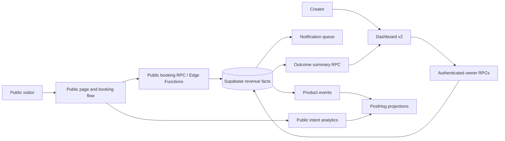
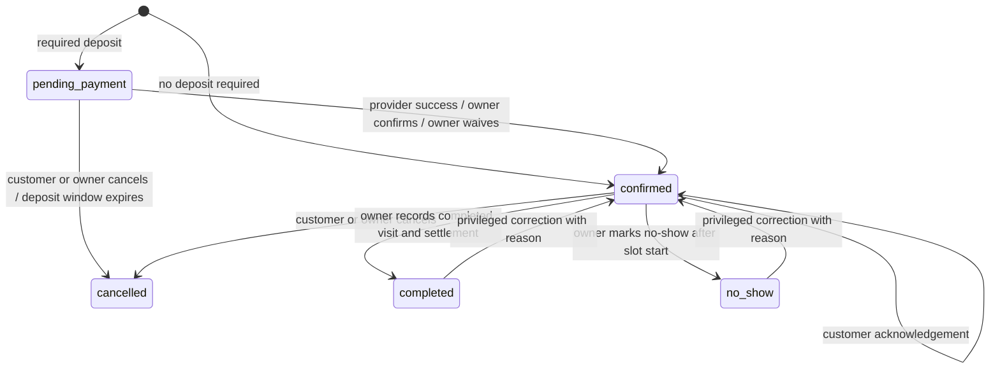

# LinkMAX Revenue Core v1 Design

**Status:** Proposed for approval

**Date:** 2026-08-29

**Strategy source:** `docs/product/COMMERCIAL_GROWTH_MASTER_PLAN_2026-08-29.md`

**Delivery scope:** P0/P1, from production trust baseline through the first completed paid appointment

## 1. Decision summary

Revenue Core v1 changes the default LinkMAX experience from a general-purpose page builder into a guided revenue workflow for solo beauty specialists in Kazakhstan:

```text
Beauty Revenue Kit
  → published service page
  → service selection
  → available slot
  → booking request
  → deposit or explicit owner confirmation
  → reminder and customer confirmation
  → completed visit with recorded payment
  → outcome dashboard
```

The implementation reuses the existing page editor, booking tables, Supabase functions, product analytics, notification queue, feature flags, verified reviews foundation, and dashboard shell. It does not create a second application or replace the existing editor.

The principal architecture decisions are:

1. Create normalized `service_offerings` as the source of truth for bookable services. Existing pricing blocks remain compatible and can optionally reference an offering.
2. Replace the ambiguous booking flags with an explicit server-enforced booking lifecycle.
3. Record deposit, balance, and refund facts in an append-only `booking_payments` ledger. Manual external payments and platform-processed payments remain distinguishable.
4. Treat business facts as server-authoritative. Client events may measure intent, but cannot produce paid/completed revenue facts.
5. Replace the current page-view dashboard wall with a deterministic outcome summary and one next-best action.
6. Release the work behind native LinkMAX feature flags to a beauty pilot cohort before general rollout.

## 2. Scope decomposition

This design is an umbrella contract for five independently releasable workstreams. Each workstream must later receive its own implementation plan and reviewer gate.

| Workstream | Independently testable outcome | Dependency |
|---|---|---|
| A. Production Trust Baseline | Canonical demo works, key screens have no duplicate sections, pricing and RU/KK copy are consistent, CI has no lint errors | None |
| B. Revenue Facts & Telemetry | A booking, payment and completion produce one authoritative, queryable revenue trail | A |
| C. Beauty Revenue Kit | A new beauty creator can configure services, availability and deposit, then publish a ready page | A, B service schema |
| D. Customer Booking Lifecycle | A visitor can book, pay or receive payment instructions, confirm, cancel or reschedule without account creation | B, C |
| E. Outcome Home & Operations | The owner sees paid outcomes, pending risks and one correct next action | B, D |

Marketplace discovery, verified review presentation, automated rebooking, memberships, studio operations, payroll, inventory, white-label and pricing-model changes are outside Revenue Core v1. Existing capabilities remain accessible through their current routes unless a feature flag explicitly hides them from the default beauty onboarding.

## 3. Target user and fixed product assumptions

### 3.1. Primary user

A solo nail, lash or brow master who:

- operates in Kazakhstan;
- accepts payment in KZT;
- acquires clients primarily from Instagram, Telegram or WhatsApp;
- uses a personal calendar or messaging thread as the current booking system;
- needs deposits, reminders and a simple client history;
- does not need staff, payroll or inventory during Revenue Core v1.

### 3.2. Supported experience

- Creator dashboard: RU and KK are release-blocking; EN must not regress.
- Public booking: RU, KK and EN are release-blocking.
- Currency: KZT for Beauty Revenue Kit v1. Existing arbitrary blocks keep their supported currencies.
- Timezone: `Asia/Almaty` is the default offered to the target cohort, but every booking stores the IANA timezone used for calculation.
- Public booking does not require a LinkMAX account.
- A booking is not called confirmed while a required deposit remains unpaid unless the owner explicitly waives the deposit or confirms an external payment.
- A visit is never auto-completed solely because its date is in the past.
- WCPA counts only bookings with `status = completed`, positive net collected amount, and no full refund within the reporting window.

## 4. Success criteria

Revenue Core v1 is ready for pilot when all of the following are true:

1. A new target user can publish a revenue-ready page in under 20 minutes during moderated testing.
2. The public visitor can complete service selection and booking on a 360 px viewport without horizontal scrolling or account creation.
3. Slot conflicts are rejected atomically and return a recoverable `slot_unavailable` state.
4. Required-deposit bookings remain `pending_payment` until a verified provider callback or authenticated owner action records payment.
5. Every booking status transition and payment mutation has actor, reason, timestamp and idempotency protection.
6. The owner can mark a visit completed and record external payment in one operation.
7. Outcome Home shows the same completed count and collected amount as the underlying booking/payment ledger.
8. Public users cannot select booking PII through Supabase policies or availability endpoints.
9. No production UI contains duplicate sections, mixed-language labels, corrupted KZT glyphs, `object Object`, implementation instructions or unqualified conversion claims.
10. Revenue Core events pass the event-contract tests and are emitted exactly once for authoritative state transitions.

## 5. Architecture

### 5.1. System boundaries



### 5.2. Sources of truth

| Concern | Source of truth | Notes |
|---|---|---|
| Page composition | Existing `pages` and `blocks` | Revenue Kit creates compatible blocks; editor remains available |
| Bookable service | New `service_offerings` | Price, duration, deposit and rebooking metadata are normalized |
| Slot availability | Existing `booking_slots` plus non-cancelled bookings | Public access moves to safe RPC; raw bookings are not public |
| Booking state | Existing `bookings`, extended | State changes only through server functions/RPCs |
| Money associated with a booking | New `booking_payments` | Append-only facts; aggregate fields on booking are projections |
| Status audit | New `booking_status_transitions` | Immutable transition history |
| Anonymous self-service access | New `booking_access_tokens` | Only token hashes stored |
| Creator business events | Existing `product_events`, extended | Authoritative event subset is server-only |
| Visitor intent events | Existing public analytics ingestion | Does not establish payment or completion facts |
| Dashboard totals | New `get_revenue_outcome_summary` RPC | Computed from bookings and payment facts |

### 5.3. Compatibility strategy

- Existing pages and blocks render unchanged when `revenue_core_v1` is disabled.
- Existing booking blocks without a linked service continue to work through a compatibility adapter. Their booking receives a `service_snapshot` assembled from current block settings and has `service_offering_id = null`.
- Existing `payment_status = none` maps to `pending` for future paid appointments or `not_applicable` only for explicitly zero-priced appointments. No historical record is silently counted as paid.
- Existing `confirmed`, `cancelled` and `completed` statuses remain valid during migration. New statuses are added without rewriting historical facts.
- Existing manual testimonials are not converted into verified reviews.

## 6. Data model

### 6.1. `service_offerings`

```sql
CREATE TABLE public.service_offerings (
  id uuid PRIMARY KEY DEFAULT gen_random_uuid(),
  page_id uuid NOT NULL REFERENCES public.pages(id) ON DELETE CASCADE,
  owner_id uuid NOT NULL REFERENCES auth.users(id) ON DELETE CASCADE,
  name_i18n jsonb NOT NULL,
  description_i18n jsonb NOT NULL DEFAULT '{}'::jsonb,
  duration_minutes integer NOT NULL CHECK (duration_minutes BETWEEN 5 AND 720),
  price_amount numeric(12,2) NOT NULL CHECK (price_amount >= 0),
  currency text NOT NULL DEFAULT 'KZT' CHECK (currency ~ '^[A-Z]{3}$'),
  deposit_mode text NOT NULL DEFAULT 'none'
    CHECK (deposit_mode IN ('none', 'fixed', 'percent')),
  deposit_value numeric(12,2) NOT NULL DEFAULT 0 CHECK (deposit_value >= 0),
  cancellation_window_hours integer NOT NULL DEFAULT 24
    CHECK (cancellation_window_hours BETWEEN 0 AND 720),
  rebooking_interval_days integer
    CHECK (rebooking_interval_days IS NULL OR rebooking_interval_days BETWEEN 1 AND 365),
  is_active boolean NOT NULL DEFAULT true,
  display_order integer NOT NULL DEFAULT 0,
  created_at timestamptz NOT NULL DEFAULT now(),
  updated_at timestamptz NOT NULL DEFAULT now(),
  UNIQUE (page_id, id)
);
```

Validation rules:

- `fixed` deposit cannot exceed `price_amount`.
- `percent` deposit is between 1 and 100.
- `none` requires `deposit_value = 0`.
- `name_i18n.ru` or `name_i18n.kk` must be a non-empty string for Beauty Revenue Kit v1.
- Only the page owner or authorized organization member can mutate offerings.
- Anonymous users can read active offerings only when the parent page is published.

### 6.2. `bookings` extensions

Add the following columns:

```sql
service_offering_id uuid REFERENCES public.service_offerings(id) ON DELETE SET NULL,
service_snapshot jsonb NOT NULL DEFAULT '{}'::jsonb,
booking_timezone text NOT NULL DEFAULT 'Asia/Almaty',
status_reason text,
deposit_due_at timestamptz,
confirmed_at timestamptz,
cancelled_at timestamptz,
completed_at timestamptz,
no_show_at timestamptz,
total_price_amount numeric(12,2) NOT NULL DEFAULT 0,
deposit_required_amount numeric(12,2) NOT NULL DEFAULT 0,
paid_amount numeric(12,2) NOT NULL DEFAULT 0,
refunded_amount numeric(12,2) NOT NULL DEFAULT 0,
payment_status text NOT NULL DEFAULT 'pending',
version integer NOT NULL DEFAULT 1 CHECK (version > 0),
client_identity_hash text,
attribution jsonb NOT NULL DEFAULT '{}'::jsonb
```

Allowed booking statuses:

```text
pending_payment
confirmed
completed
cancelled
no_show
```

Allowed payment statuses:

```text
not_applicable
pending
partially_paid
paid
partially_refunded
refunded
failed
waived
```

`service_snapshot` contains immutable booking-time values:

```ts
interface BookingServiceSnapshot {
  serviceOfferingId: string | null;
  name: string;
  durationMinutes: number;
  priceAmount: number;
  currency: 'KZT' | string;
  depositMode: 'none' | 'fixed' | 'percent';
  depositRequiredAmount: number;
  cancellationWindowHours: number;
}
```

The snapshot prevents later service edits from changing historical revenue facts.

`client_identity_hash` is produced server-side with an application secret from normalized phone or normalized email. Raw contact values remain on the booking for owner operations, but analytics and PostHog receive only the hash.

`attribution` accepts only this allowlisted shape, with every string capped at 200 characters:

```ts
interface BookingAttribution {
  visitorId: string | null;
  sessionId: string | null;
  source: string | null;
  medium: string | null;
  campaign: string | null;
  content: string | null;
  referrerHost: string | null;
  landingPath: string | null;
  smartLinkId: string | null;
}
```

Raw referrer URLs, query strings, IP addresses and message contents are not stored in the attribution snapshot.

### 6.3. `booking_payments`

```sql
CREATE TABLE public.booking_payments (
  id uuid PRIMARY KEY DEFAULT gen_random_uuid(),
  booking_id uuid NOT NULL REFERENCES public.bookings(id) ON DELETE CASCADE,
  owner_id uuid NOT NULL REFERENCES auth.users(id) ON DELETE CASCADE,
  kind text NOT NULL CHECK (kind IN ('deposit', 'balance', 'refund')),
  status text NOT NULL CHECK (status IN ('succeeded', 'failed')),
  amount numeric(12,2) NOT NULL CHECK (amount > 0),
  currency text NOT NULL DEFAULT 'KZT' CHECK (currency ~ '^[A-Z]{3}$'),
  method text NOT NULL CHECK (method IN (
    'kaspi_manual', 'cash', 'manual_card', 'bank_transfer', 'robokassa', 'other'
  )),
  processing_source text NOT NULL CHECK (processing_source IN ('external_manual', 'platform')),
  provider text,
  provider_reference text,
  confirmed_by uuid REFERENCES auth.users(id) ON DELETE SET NULL,
  confirmed_at timestamptz,
  idempotency_key text NOT NULL UNIQUE,
  metadata jsonb NOT NULL DEFAULT '{}'::jsonb,
  created_at timestamptz NOT NULL DEFAULT now()
);
```

Rules:

- Rows are immutable after insert. Corrections are compensating `refund` rows.
- Payment initiation and provider-pending states are operational events, not financial ledger rows. A provider success callback or authenticated manual confirmation inserts the succeeded financial fact.
- Provider callbacks use provider event IDs as idempotency keys.
- Manual confirmation uses a client-generated mutation UUID accepted exactly once by an authenticated RPC.
- External manual payments do not create `wallet_transactions`; the wallet represents money actually processed by LinkMAX.
- A trigger refreshes `bookings.paid_amount`, `refunded_amount` and `payment_status` after an insert.

### 6.4. `booking_status_transitions`

```sql
CREATE TABLE public.booking_status_transitions (
  id uuid PRIMARY KEY DEFAULT gen_random_uuid(),
  booking_id uuid NOT NULL REFERENCES public.bookings(id) ON DELETE CASCADE,
  from_status text,
  to_status text NOT NULL,
  actor_type text NOT NULL CHECK (actor_type IN ('visitor', 'owner', 'system', 'provider')),
  actor_user_id uuid REFERENCES auth.users(id) ON DELETE SET NULL,
  reason_code text NOT NULL,
  metadata jsonb NOT NULL DEFAULT '{}'::jsonb,
  idempotency_key text NOT NULL UNIQUE,
  occurred_at timestamptz NOT NULL DEFAULT now()
);
```

Direct client updates to `bookings.status` are removed. All transitions go through state-machine functions.

### 6.5. `booking_access_tokens`

```sql
CREATE TABLE public.booking_access_tokens (
  id uuid PRIMARY KEY DEFAULT gen_random_uuid(),
  booking_id uuid NOT NULL REFERENCES public.bookings(id) ON DELETE CASCADE,
  token_hash text NOT NULL UNIQUE,
  scopes text[] NOT NULL DEFAULT ARRAY['read', 'confirm', 'cancel', 'reschedule'],
  expires_at timestamptz NOT NULL,
  revoked_at timestamptz,
  created_at timestamptz NOT NULL DEFAULT now()
);
```

The raw token is returned once and delivered in customer links. The public RPC returns only safe booking context: service label, local date/time, location text, deposit state and allowed actions. It never returns owner internals, other bookings or full payment-provider payloads.

## 7. Booking state machine

### 7.1. Transitions



### 7.2. Transition guards

- `pending_payment → confirmed`: successful deposit ledger entry, explicit authenticated payment confirmation, or explicit authenticated waiver.
- `confirmed → completed`: current time is after slot start; owner submits collected amount and payment method. Zero collected amount creates a completed-free outcome and does not count in WCPA.
- `confirmed → no_show`: current time is after slot start and owner supplies a reason code.
- Customer cancellation respects the policy window in copy and analytics; Revenue Core v1 does not automatically retain or refund money without a provider-supported operation.
- Corrections from terminal states require owner/admin authorization, a non-empty reason, and a compensating status transition. History is never deleted.
- `auto_complete_past_bookings` is disabled for Revenue Core v1. Past confirmed appointments become an owner action queue.

### 7.3. RPC contracts

```ts
type BookingMutationResult =
  | { ok: true; bookingId: string; status: BookingStatus; version: number }
  | { ok: false; code: BookingErrorCode; retryable: boolean };

type BookingErrorCode =
  | 'invalid_input'
  | 'page_not_public'
  | 'service_unavailable'
  | 'slot_unavailable'
  | 'deposit_configuration_invalid'
  | 'booking_not_found'
  | 'token_invalid'
  | 'token_expired'
  | 'transition_not_allowed'
  | 'payment_already_recorded'
  | 'rate_limited'
  | 'internal_error';
```

Required server operations:

- `get_public_booking_context(p_page_slug, p_service_id)`
- `get_public_availability(p_page_id, p_service_id, p_from_date, p_to_date)`
- `create_public_booking(p_payload jsonb, p_idempotency_key text)`
- `get_booking_by_access_token(p_token text)`
- `manage_booking_by_access_token(p_token text, p_action text, p_payload jsonb, p_idempotency_key text)`
- `record_manual_booking_payment(p_booking_id, p_kind, p_amount, p_method, p_idempotency_key)`
- `transition_booking(p_booking_id, p_to_status, p_reason_code, p_payload, p_expected_version, p_idempotency_key)`
- `get_revenue_outcome_summary(p_page_id, p_from, p_to)`

All currency amounts cross the TypeScript boundary as decimal strings and are converted to `numeric` in PostgreSQL. JavaScript floating-point values are not used for ledger calculations.

Every booking mutation uses optimistic concurrency. The function locks the booking row, compares `p_expected_version`, increments `version` on success and returns `transition_not_allowed` with the current safe state when the caller is stale.

## 8. Beauty Revenue Kit

### 8.1. Guided setup screens

The existing `AIBuilderWizard` remains available for general pages. The feature-flagged beauty cohort receives `RevenueKitWizard` with six explicit steps:

1. **Business identity** — display name, city, specialization, avatar and contact channel.
2. **Services** — start from nail/lash/brow presets; edit name, price and duration; at least one active service required.
3. **Availability** — working days, hours, breaks, timezone and booking horizon.
4. **Deposit and cancellation** — none/fixed/percent, payment instructions, cancellation window and honest preview of what the client sees.
5. **Trust and preview** — portfolio, contact button, policy, service cards and booking flow preview at 360 px.
6. **Publish and distribute** — publish, copy canonical URL, Instagram bio instructions, Telegram share and QR download.

Each step autosaves a server draft. Returning users resume at the first incomplete step. A user can leave the wizard and use the advanced editor without losing normalized services.

### 8.2. Kit manifest

`src/domain/revenue-kits/beauty-v1.ts` defines an immutable manifest:

```ts
export interface RevenueKitManifest {
  id: 'beauty-v1';
  version: 1;
  supportedNiches: Array<'nails' | 'lashes' | 'brows'>;
  requiredBlockTypes: Array<'profile' | 'pricing' | 'booking' | 'messenger'>;
  optionalBlockTypes: Array<'carousel' | 'testimonial' | 'faq' | 'map'>;
  defaultTimezone: 'Asia/Almaty';
  defaultCurrency: 'KZT';
}
```

Applying the kit is transactional through `apply_revenue_kit_v1`. It:

- validates page ownership;
- upserts submitted `service_offerings`;
- creates or updates one linked pricing block and one linked booking block;
- preserves unrelated user-created blocks;
- stores manifest ID/version in block content;
- returns offering and block IDs;
- emits one `revenue_kit_applied` event using the mutation idempotency key.

Reapplying the kit updates only kit-managed fields. It never deletes unrelated blocks or inactive historical services.

### 8.3. Block linkage

Extend `PricingItem` with `serviceOfferingId?: string` and `BookingBlock` with `serviceOfferingIds?: string[]`. Clicking a linked pricing item opens the booking flow with that service preselected. Editing a linked service in guided mode writes to `service_offerings` and refreshes the presentation block. Advanced editor copy changes do not mutate historical bookings.

## 9. Public customer experience

### 9.1. Service-to-booking flow

The public flow has five visible states:

1. **Service selected** — name, price, duration, deposit and cancellation policy.
2. **Date and time** — available dates and local timezone; unavailable slots are not exposed as bookings.
3. **Contact details** — name plus one required contact method; notes and second contact method are optional.
4. **Deposit state**:
   - platform provider: redirect/embedded provider and webhook-confirmed result;
   - Kaspi/manual: clear instructions and `Ожидает подтверждения предоплаты`, not `Вы записаны`;
   - no deposit: booking is immediately confirmed.
5. **Booking management** — confirmation code, safe tokenized link, add-to-calendar, confirm attendance, cancel or reschedule.

### 9.2. Error recovery

| Error | Customer experience | Server behavior |
|---|---|---|
| Slot taken during submit | Return to same date, highlight conflict, load fresh slots | Transaction rolls back; no partial booking |
| Payment provider timeout | Show pending state and management link | Reconciliation can later confirm via webhook |
| Manual payment not yet confirmed | Show instructions and pending status | Booking remains `pending_payment` |
| Notification failed | Booking still succeeds; show management link directly | Queue retries with same idempotency key |
| Token expired | Safe expired page with owner contact CTA | No booking PII returned |
| Rate limit | Preserve entered non-sensitive form fields in memory and invite retry | No booking created |
| Booking configuration invalid | Hide broken widget and show direct contact fallback | Emit owner-visible configuration alert |

### 9.3. Accessibility and performance

- All steps are keyboard accessible and use visible focus states.
- Date/slot selection exposes selected and unavailable semantics to screen readers.
- Errors are announced through an ARIA live region and focus moves to the error summary.
- Public booking JavaScript is lazy-loaded only when booking enters the viewport or the service CTA is activated.
- Public page LCP target is under 2.5 seconds at p75 mobile; Revenue Kit code must not increase initial public bundle by more than 35 KB gzip.
- Animations respect `prefers-reduced-motion`; booking success does not depend on confetti.

## 10. Creator experience

### 10.1. Outcome Home

For the beauty cohort, Home has three layers:

1. **Outcome strip** — completed paid visits, collected revenue, upcoming confirmed visits and pending-payment amount for the selected period.
2. **Next best action** — exactly one action card with explanation and CTA.
3. **Operational list** — appointments requiring attention, followed by a collapsed link to page/editor/SEO details.

Page views, CTR, SEO score, wallet and page card move below the operational outcome or into Insights/Finance. They are not repeated on Home.

### 10.2. Deterministic next-best-action rules

Rules run in this order and return the first match:

```ts
type RevenueNextActionId =
  | 'start_revenue_kit'
  | 'add_first_service'
  | 'set_availability'
  | 'configure_deposit'
  | 'publish_page'
  | 'copy_bio_link'
  | 'confirm_pending_deposit'
  | 'review_past_appointments'
  | 'send_upcoming_confirmation'
  | 'improve_booking_conversion'
  | 'open_outcome_insights';
```

Priority:

1. No kit → start kit.
2. No active service → add service.
3. No future availability → set availability.
4. Deposit selected but instructions invalid → configure deposit.
5. Page unpublished → publish.
6. No attributed external visit → copy bio link.
7. Required deposit pending → confirm deposit.
8. Past confirmed appointment → mark completed/no-show.
9. Upcoming booking unacknowledged inside reminder window → send confirmation.
10. At least 50 qualified service views with no booking and valid availability → improve booking conversion.
11. Otherwise → open outcome insights.

Rule 10 uses a minimum sample and states what was observed. It does not claim a universal conversion uplift.

### 10.3. Booking detail

The booking detail drawer shows:

- service snapshot;
- local date/time and customer timezone;
- contact actions;
- deposit and balance ledger;
- status history;
- attribution summary;
- notification delivery status;
- allowed next state actions only.

The primary action changes by state: confirm payment, send reminder, complete visit and record payment, mark no-show, or inspect completed outcome.

## 11. Event taxonomy and measurement contract

### 11.1. Consolidation rule

The repository currently has public canonical events, `activation:*` events and authenticated `product_events`. Revenue Core v1 does not add a fourth generic event store.

- Visitor intent is accepted by the hardened public analytics ingestion and may be mirrored to PostHog.
- Booking, payment, refund, notification delivery and completion facts are emitted by database functions, Edge Functions or provider webhooks into `product_events` with `source = edge|system`.
- Client code cannot emit authoritative event names.
- Legacy activation names remain readable but new Revenue Core code imports only the v2 taxonomy facade.

### 11.2. Canonical events

```ts
export const REVENUE_EVENTS = {
  revenueKitStarted: 'revenue_kit_started',
  revenueKitStepCompleted: 'revenue_kit_step_completed',
  revenueKitApplied: 'revenue_kit_applied',
  pagePublished: 'page_published',
  bioLinkCopied: 'bio_link_copied',
  serviceViewed: 'service_viewed',
  bookingStarted: 'booking_started',
  bookingSlotSelected: 'booking_slot_selected',
  bookingDetailsSubmitted: 'booking_details_submitted',
  bookingCreated: 'booking_created',
  depositInstructionsViewed: 'deposit_instructions_viewed',
  depositPaymentStarted: 'deposit_payment_started',
  depositPaymentSucceeded: 'deposit_payment_succeeded',
  depositPaymentManuallyConfirmed: 'deposit_payment_manually_confirmed',
  bookingConfirmed: 'booking_confirmed',
  reminderQueued: 'reminder_queued',
  reminderDelivered: 'reminder_delivered',
  customerAttendanceConfirmed: 'customer_attendance_confirmed',
  bookingRescheduled: 'booking_rescheduled',
  bookingCancelled: 'booking_cancelled',
  bookingCompleted: 'booking_completed',
  bookingNoShow: 'booking_no_show',
  bookingPaymentRecorded: 'booking_payment_recorded',
  bookingRefundRecorded: 'booking_refund_recorded',
  outcomeDashboardViewed: 'outcome_dashboard_viewed',
  nextBestActionClicked: 'next_best_action_clicked',
} as const;
```

### 11.3. Common envelope

```ts
interface RevenueEventEnvelope {
  taxonomyVersion: 2;
  eventId: string;
  eventName: RevenueEventName;
  occurredAt: string;
  actorType: 'visitor' | 'creator' | 'system' | 'provider';
  userId: string | null;
  pageId: string;
  serviceOfferingId: string | null;
  bookingId: string | null;
  visitorId: string | null;
  sessionId: string | null;
  source: 'client' | 'edge' | 'system';
  properties: Record<string, string | number | boolean | null>;
}
```

Forbidden event properties:

- name, email, phone, free-form notes;
- raw payment-provider payload;
- raw referrer URL or query string;
- access tokens;
- full IP address.

### 11.4. Event authority

| Event | Authority | Idempotency source |
|---|---|---|
| `service_viewed`, `booking_started`, `booking_slot_selected` | Client/public ingestion | generated event ID per browser action |
| `booking_created` | `create_public_booking` transaction | booking creation mutation key |
| `deposit_payment_succeeded` | Provider webhook | provider event ID |
| `deposit_payment_manually_confirmed` | Authenticated owner RPC | mutation UUID |
| `booking_confirmed/cancelled/rescheduled/completed/no_show` | State transition function | transition row idempotency key |
| `reminder_delivered` | Notification processor/provider result | queue idempotency key + channel |
| `booking_payment_recorded/refund_recorded` | Payment ledger insert | payment idempotency key |

### 11.5. North Star query

WCPA for a seven-day completion window is:

```sql
COUNT(DISTINCT booking_id)
WHERE booking.status = 'completed'
  AND booking.completed_at >= period_start
  AND booking.completed_at < period_end
  AND booking.paid_amount - booking.refunded_amount > 0
  AND no full refund exists before period_end + interval '7 days'
```

The dashboard initially marks the most recent seven days as provisional until the refund window closes.

## 12. Outcome summary contract

```ts
interface RevenueOutcomeSummary {
  period: { from: string; to: string; timezone: string };
  completedPaidAppointments: number;
  completedFreeAppointments: number;
  grossCollected: string;
  refunded: string;
  netCollected: string;
  currency: string;
  upcomingConfirmed: number;
  pendingPaymentCount: number;
  pendingPaymentAmount: string;
  pastAppointmentsNeedingReview: number;
  noShowCount: number;
  bySource: Array<{
    source: string;
    completedPaidAppointments: number;
    netCollected: string;
  }>;
  nextAction: {
    id: RevenueNextActionId;
    href: string;
    reasonCode: string;
  };
  generatedAt: string;
}
```

The RPC returns only pages the current authenticated owner/member may manage. Financial decimals are returned as strings.

## 13. Notifications

Revenue Core v1 reuses `notification_queue` and `process-notifications`.

Required changes:

- Every booking notification payload includes `booking_id`, `recipient_role`, `channel`, `template_key`, locale and safe template variables.
- Idempotency keys use `booking:{booking_id}:{template_key}:{channel}:{scheduled_window}`.
- Queue status and provider result are retained long enough to calculate delivery rate.
- Reminder scheduling is based on booking timezone and supports 24-hour and 2-hour templates.
- Customer notification is sent only when a valid customer destination exists and consent/transactional basis is satisfied.
- Owner notification failure never rolls back a valid booking.
- The booking management URL is included in every customer confirmation/reminder.
- Marketing and rebooking messages are not part of Revenue Core v1; transactional messages cannot silently opt a user into marketing.

## 14. Feature flags and rollout

Use the existing native feature flag service.

| Flag | Default | Audience | Purpose |
|---|---|---|---|
| `revenue_core_v1` | off | Internal accounts, then beauty pilot | Enables new schema adapters and safe booking flow |
| `beauty_revenue_kit_v1` | off | `niche in nails/lashes/brows`, pilot allowlist | Replaces generic first-run wizard |
| `outcome_home_v1` | off | Users with `revenue_core_v1` | Enables outcome-focused Home |
| `booking_self_service_v1` | off | Bookings created by new flow | Enables tokenized confirmation/cancel/reschedule |

Rollout stages:

1. Local and CI fixtures.
2. Internal production accounts.
3. Five concierge pilot creators.
4. Twenty-five beauty creators, monitoring daily.
5. One hundred beauty creators after seven stable days.
6. Default on for new target-cohort users after success criteria hold for two consecutive cohorts.

Rollback disables UI entry points but does not delete new facts. Old pages continue to render through compatibility adapters. Database migrations are forward-only.

## 15. Production trust baseline

### 15.1. Canonical demo

- Canonical public demo is `/demo-nails`.
- `/demo_nails` returns a permanent redirect to `/demo-nails`.
- GTM documents, landing pages, sitemap and automated smoke tests reference only the canonical URL.
- Demo figures and testimonials are labeled `Демонстрационные данные` unless backed by a real, consented case study.

### 15.2. Pricing source of truth

Create `src/domain/billing/catalog.ts` as the only application source for plan names, billing periods, KZT totals, derived monthly display prices and platform commission rates. `src/domain/billing/tiers.ts`, `src/services/user.ts`, landing pricing, paywalls, SEO structured data and FAQ consume this catalog.

Revenue Core v1 does not change commercial prices. It eliminates contradictions first. A separate approved experiment may later test 0% platform fee for direct traffic.

### 15.3. Copy and rendering gates

- Remove unsupported uplift percentages from Home and Insights.
- Replace them with observed user-specific facts or neutral recommendations.
- Add DOM tests asserting one Home performance region, one AI/recommendation region and one bottom navigation.
- Add localization checks for corrupted `₸`, Cyrillic text in EN keys, English labels in RU/KK release paths and raw interpolation artifacts.
- Add public page assertions against doubled currency and phone prefixes.
- Fix the current blocking ESLint error, then enforce no increase over the captured warning baseline. New/modified Revenue Core files allow zero warnings.

## 16. Security and privacy

### 16.1. RLS requirements

- Remove anonymous raw `SELECT` access to `bookings`.
- Public availability is exposed only through a `SECURITY DEFINER` RPC with fixed `search_path`, strict parameters and public-safe return columns.
- Anonymous booking creation occurs only through `create_public_booking`; direct anonymous inserts are removed.
- Owners and authorized organization members can select their booking facts.
- `booking_payments` and status transitions are never anonymously selectable.
- Owner mutations verify page ownership or organization role inside the transaction.
- Every `SECURITY DEFINER` function revokes `PUBLIC` execution and grants only required roles.

### 16.2. Abuse controls

- Rate limit booking creation by page plus privacy-preserving visitor/IP signal.
- Enforce body size and field length before parsing free-form content.
- Normalize and validate E.164-like phone input without assuming a single country prefix.
- Reject client-supplied owner IDs, prices, deposit amounts, payment status and service snapshots; derive them from server records.
- Use constant-time token hash comparisons through indexed hash lookup.
- Redact PII and tokens from logs, Sentry and PostHog.

### 16.3. Audit requirements

The following actions must be attributable and immutable: manual payment confirmation, payment waiver, refund, completion, no-show, cancellation after deposit, terminal-state correction and access-token revocation.

## 17. File map

### 17.1. New domain files

| File | Responsibility |
|---|---|
| `src/domain/revenue/service-offering.ts` | Pure types and validation for services/deposits |
| `src/domain/revenue/booking-lifecycle.ts` | Allowed transitions and client-safe reason codes |
| `src/domain/revenue/money.ts` | Decimal-string validation and display conversion boundaries |
| `src/domain/revenue/events.ts` | Revenue v2 event names, envelope and authority map |
| `src/domain/revenue/next-best-action.ts` | Pure deterministic next-action rules |
| `src/domain/revenue-kits/beauty-v1.ts` | Immutable beauty manifest and presets |

### 17.2. New services/hooks

| File | Responsibility |
|---|---|
| `src/services/revenue-kit.ts` | Apply/resume kit RPC adapter |
| `src/services/booking-lifecycle.ts` | Owner and tokenized booking mutation adapters |
| `src/services/revenue-outcomes.ts` | Outcome summary RPC adapter |
| `src/hooks/revenue/useRevenueKit.ts` | Wizard draft/query/mutation state |
| `src/hooks/revenue/useRevenueOutcomeSummary.ts` | Query and cache outcome summary |
| `src/hooks/revenue/useBookingOperations.ts` | Owner booking actions with idempotency keys |

### 17.3. New UI

| File | Responsibility |
|---|---|
| `src/components/onboarding/revenue-kit/RevenueKitWizard.tsx` | Six-step shell and resume logic |
| `src/components/onboarding/revenue-kit/IdentityStep.tsx` | Identity inputs |
| `src/components/onboarding/revenue-kit/ServicesStep.tsx` | Service presets and editing |
| `src/components/onboarding/revenue-kit/AvailabilityStep.tsx` | Weekly availability and timezone |
| `src/components/onboarding/revenue-kit/DepositPolicyStep.tsx` | Deposit and cancellation policy |
| `src/components/onboarding/revenue-kit/TrustPreviewStep.tsx` | Portfolio/trust requirements and 360 px preview |
| `src/components/onboarding/revenue-kit/PublishDistributeStep.tsx` | Publish and channel distribution |
| `src/components/booking/PublicBookingFlow.tsx` | Service/date/contact/deposit/manage state machine |
| `src/components/booking/BookingManagementPage.tsx` | Tokenized customer self-service |
| `src/components/dashboard-v2/revenue/OutcomeStrip.tsx` | Completed, collected, upcoming and pending metrics |
| `src/components/dashboard-v2/revenue/NextRevenueAction.tsx` | One deterministic action card |
| `src/components/dashboard-v2/revenue/AttentionQueue.tsx` | Pending payment and past appointment tasks |
| `src/components/dashboard-v2/revenue/BookingDetailDrawer.tsx` | State, payment and history operations |

### 17.4. Existing files to change

- `src/pages/DashboardV2.tsx` — feature-flagged wizard and outcome Home composition.
- `src/components/dashboard-v2/screens/HomeScreen.tsx` — move current page/SEO/traffic widgets below Revenue Core composition and remove duplicate regions.
- `src/components/dashboard-v2/screens/ActivityScreen.tsx` — open booking detail and attention queues.
- `src/components/dashboard-v2/screens/InsightsScreen.tsx` — revenue funnel and source-to-completion views.
- `src/components/blocks/BookingBlock.tsx` — become a thin compatibility wrapper around `PublicBookingFlow`.
- `src/components/block-editors/BookingBlockEditor.tsx` — link offerings and guide advanced settings.
- `src/types/blocks/commerce.ts` — offering linkage; keep legacy fields for compatibility.
- `src/lib/analytics/event-taxonomy.ts` — export v2 facade and legacy mapping.
- `src/lib/activation-events.ts` — stop direct revenue-fact emission and map deprecated event names.
- `src/services/product-analytics.ts` — accept v2 event projection; authoritative names are not client-callable.
- `src/lib/posthog.ts` — sanitized capture adapter.
- `src/domain/billing/tiers.ts` and all pricing consumers — consume billing catalog.
- `supabase/functions/submit-booking/index.ts` — delegate to atomic database operation; do not trust payment/service fields.
- `supabase/functions/send-booking-notification/index.ts` — customer/owner transactional templates and idempotency.
- `supabase/functions/send-booking-reminder/index.ts` — timezone, token URL and delivery facts.
- `supabase/functions/process-notifications/index.ts` — durable delivery result projection.

### 17.5. Database migrations

Use ordered forward-only migrations:

1. `*_revenue_service_offerings.sql`
2. `*_booking_lifecycle_and_payment_ledger.sql`
3. `*_booking_public_access_hardening.sql`
4. `*_revenue_event_taxonomy_v2.sql`
5. `*_revenue_outcome_summary.sql`
6. `*_beauty_revenue_kit_rpc_and_flags.sql`

Generated Supabase types are refreshed only after all six migrations apply cleanly to an empty database and a current-schema clone.

## 18. Testing strategy

### 18.1. Domain unit tests

- Deposit calculations for none/fixed/percent, including rounding and upper bounds.
- Every allowed and forbidden booking transition.
- Payment aggregate projection for deposit, balance, partial refund and full refund.
- Next-best-action ordering with one result per state.
- Event authority: client cannot emit authoritative names.
- Attribution allowlist and PII rejection.

### 18.2. Database tests

- RLS: anonymous cannot select booking PII.
- Public availability returns occupied state without booking identity.
- Concurrent booking creation for one slot yields one success and one `slot_unavailable`.
- Duplicate mutation/payment/provider key produces one row and stable success response.
- Invalid service/page ownership is rejected.
- Manual payment requires owner/member authorization.
- Direct status update is rejected; state RPC creates transition audit.
- WCPA query excludes zero-payment, fully refunded, cancelled and no-show records.
- Kit reapplication preserves unrelated blocks.

### 18.3. Component tests

- Wizard resume and validation for each step.
- 360 px booking flow with keyboard navigation.
- Required manual deposit displays pending language, never confirmed language.
- Conflict response returns the user to refreshed slot selection.
- Outcome Home renders one outcome strip and one next action.
- Booking detail exposes only legal actions for the current state.
- RU/KK/EN copy contains no raw keys or mixed-language labels in the golden path.

### 18.4. E2E journeys

1. New nail master → kit → publish → visitor → no-deposit booking → owner completes and records cash/Kaspi payment → outcome Home increments.
2. Required manual deposit → booking pending → owner confirms Kaspi deposit → booking confirmed → reminder delivered → completed balance recorded.
3. Provider deposit → webhook replayed twice → one payment and one confirmation transition.
4. Two visitors select same slot → first wins, second recovers with new slots.
5. Customer token → reschedule → old slot released and new slot reserved atomically.
6. Customer token → cancel → owner queue and summary update.
7. Past confirmed booking → Home attention queue → owner marks no-show.
8. Feature flag off → existing public and dashboard booking behavior remains available.

### 18.5. Production smoke tests

- `/demo-nails` returns 200 and canonical metadata.
- `/demo_nails` redirects permanently.
- Pricing values match billing catalog.
- Public demo contains no duplicated booking or FAQ region.
- Production booking can create and cancel a flagged synthetic appointment without contacting a real customer.

## 19. Observability and operations

Create operational dashboards for:

- booking creation success/error by code;
- slot-conflict rate;
- pending-payment age distribution;
- payment confirmation source and latency;
- notification delivery/retry/failure by channel;
- confirmed → completed/no-show/cancelled transition rate;
- outcome RPC latency/error;
- event duplicate and missing-authority checks;
- WCPA by cohort and acquisition source;
- support contacts per 100 completed bookings.

Alerts:

- booking creation success below 98% for valid attempts over 15 minutes;
- provider webhook signature failures above 1% over 15 minutes;
- notification terminal failure above 5% over one hour;
- outcome RPC p95 above 1 second over 15 minutes;
- any authoritative event emitted from `source = client`;
- any negative net collected projection.

## 20. Release gates

### Gate A: Trust baseline

- Canonical demo smoke test passes.
- Key screens have one instance of each major region.
- Pricing catalog is the only runtime source.
- Lint has zero errors and Revenue Core files have zero warnings.

### Gate B: Revenue facts

- Database and concurrency tests pass.
- Owner and anonymous RLS matrix passes.
- Payment and transition idempotency tests pass.
- Product event facts reconcile with ledger facts in fixtures.

### Gate C: Five-user pilot

- All five publish without engineering database edits.
- At least three receive a real booking through the new flow.
- No booking or payment fact requires manual SQL repair.
- Every issue has a safe recovery path or rollback.

### Gate D: Twenty-five-user cohort

- At least 40% publish within 24 hours.
- Booking creation technical success is at least 98% for valid attempts.
- Revenue totals reconcile for all completed pilot bookings.
- No P0 privacy, payment or double-booking incident occurs.

### Gate E: Hundred-user cohort

- Median time-to-publish is under 20 minutes.
- At least 20% of published target creators receive a booking within 14 days, subject to baseline traffic qualification.
- Eight-week retention measurement is active before default rollout.

## 21. Explicit non-goals

- No automatic interpretation of Kaspi payment as successful without a verified integration or owner confirmation.
- No automatic completion of past bookings.
- No marketplace ranking or acquisition commission.
- No automated marketing or rebooking campaigns.
- No generalized workflow builder.
- No new CRM object framework.
- No staff/resource optimization beyond preserving existing behavior.
- No inventory, payroll, accounting or tax calculation.
- No redesign of every dashboard route.
- No deletion of existing advanced modules.

## 22. Open product decisions resolved by this spec

| Question | Decision |
|---|---|
| What is the first ICP? | Solo nail/lash/brow specialists in Kazakhstan |
| What outcome defines activation? | First completed appointment with positive net collected amount |
| Is a required-deposit booking immediately confirmed? | No |
| Can the browser assert a payment succeeded? | No |
| Does manual Kaspi money enter the LinkMAX wallet? | No; it is external revenue with explicit confirmation |
| Are old bookings auto-completed? | No |
| Are services kept only inside block JSON? | No; bookable services use normalized offerings and immutable booking snapshots |
| Is AI responsible for the next action? | No in v1; deterministic rules first |
| Is PostHog the financial source of truth? | No; Supabase ledger/state is authoritative, PostHog is analysis/projection |
| Does this release change prices or commission? | No; it establishes a single source of truth and instrumentation for a later approved experiment |

## 23. Self-review result

- No placeholder requirements remain.
- Revenue facts have one source of truth and client/server authority is explicit.
- Manual and provider payments are intentionally separated.
- Existing pages and booking blocks have a compatibility path.
- P0/P1 is decomposed into five independently reviewable implementation plans.
- Marketplace, rebooking and studio work are excluded from this release.
- Every success criterion maps to a database, component, E2E or production smoke test.
